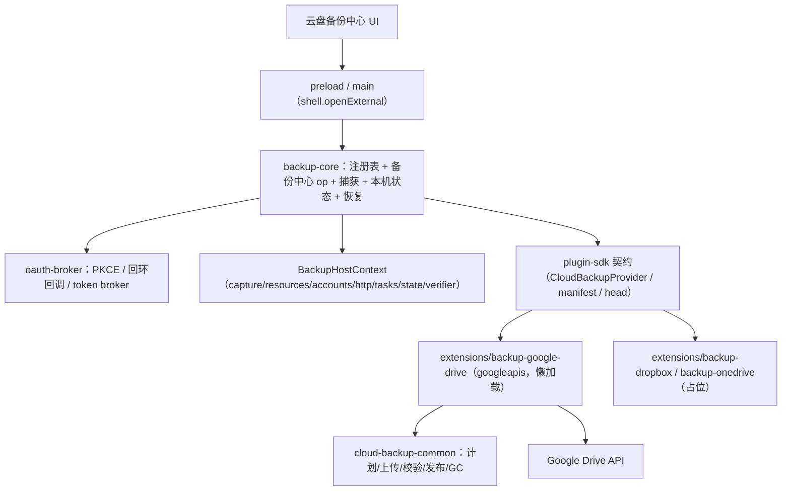

## Product Overview
按《Anynote 云盘备份设计文档》落地云盘备份基础能力：核心程序提供统一的备份中心、账号授权、任务调度、一致性数据捕获、资源访问、凭据保护与恢复验证；具体云盘对接由官方扩展实现。本轮完成 **Google Drive 的备份到恢复端到端闭环**，Dropbox 与 OneDrive 先提供可发现的占位扩展（不接真实 API）。

## Core Features
- 备份中心：以低噪声卡片列出每个云盘目标，显示厂商图标、账号显示名、连接/权限状态、最近完成时间、待传体积、进度与可用空间；三家独立显示，不合成掩盖部分失败的状态。
- 添加云盘目标：设置中「备份 → 添加目标 → 云盘」，选择 Google Drive / Dropbox / OneDrive；展示扩展来源、将申请的权限与数据存放范围；未安装则安装官方扩展。
- 账号授权：点击连接后用系统浏览器完成登录授权，返回应用确认账号、应用备份目录与要备份的 Notebook，再设置频率并执行第一次备份。普通用户无需填写开发者凭据。
- 备份：手动「立即备份」与可配置自动频率；文件级增量，未变化不上传新数据库与附件，无变化时仍确认当前指针状态；支持离线等待、暂停/取消与失败重试。
- 恢复：选择账号 → 列出 Notebook 与备份设备槽 → 选择当前副本 → 显示时间、大小、条目数与校验状态 → 下载到新工作目录并校验，默认恢复为新 Notebook，不覆盖本地正在工作的库。
- 断开与删除：断开只停止任务并清除本机 token，不删除远端副本；「删除云端备份」是独立显式操作，需展示目标、Notebook 与设备槽范围后确认。
- 状态与提示：等待网络、登录已过期、空间不足、权限不足、上传中、重试中、已完成、备份已更新但清理待重试；明确区分「本地已保存」与「云盘待备份」。
- 边界：Dropbox / OneDrive 本轮标记 Beta/占位，仅提供入口与接口占位，不承诺可用；不做实时同步、冲突合并与云端历史快照，每个设备槽只保留一份当前完整副本。


## Tech Stack
- 语言/运行时：TypeScript + Node.js 24（Electron Utility Process 内的存储进程），NodeNext ESM，`strict`。
- 桌面：Electron 41（主进程 + `utilityProcess` 存储进程 + 沙箱渲染进程），React 19 + Vite。
- 校验/测试：`zod` 运行时校验；Vitest（`tests/*.test.mjs`）+ `tsconfig.type-tests.json` 类型测试。
- 工作区：pnpm workspace（`isolated`、`hoist: false`）；新增 `extensions/*` 需登记进 `pnpm-workspace.yaml` 与 `tsconfig.backend.json`。
- 厂商 SDK：Google Drive 使用官方 `googleapis`（懒加载，作为 `extensions/backup-google-drive` 依赖）；Dropbox/OneDrive 本轮不引入依赖。
- 复用现有能力：`node:sqlite` Online Backup、Electron `safeStorage`、现有 `packages/backup` 的快照与策略引擎、`packages/plugin-sdk` 的权限/作用域门面。

## Implementation Approach
核心策略：**核心提供不可绕过的数据保护与协议，扩展提供可替换的云盘行为**，两者通过公共 SDK 契约连接；核心不出现任何厂商分支。

1. **先扩契约，再落实现**：在 `packages/plugin-sdk` 定义 `CloudBackupProvider`（§15.1）、`CloudBackupCapabilities`、`BackupHostContext`（§15.2）、`current.json` head 与 manifest、验证等级类型，并新增 `createCloudBackupAPI` 操作映射与声明式 `contributes.backupProviders`；同步 `packages/types` 的 `Operation`、`packages/protocol/src/operations.json` 白名单与 `release.ts` 格式登记，保证「渲染进程可调 op + 发布矩阵」不脱钩。
2. **OAuth 由核心统一执行**：`packages/oauth-broker` 实现 Authorization Code + PKCE(S256) + state，回环监听仅绑定 `127.0.0.1` 的临时端口、短期存活；用系统浏览器（主进程 `shell.openExternal`）完成登录；token 按 `providerId + OAuthClientId + accountId + tenant/drive context` 引用存储，落 Electron `safeStorage`（复用 `storage.vault`），Renderer 永不持有 refresh token；刷新用 single-flight，`invalid_grant` 转「需要重新登录」，不无限重试。
3. **捕获与提交分离**：`packages/backup-core` 复用现有 `createFileSnapshot()`/`captureLocalNotebook()` 生成一致性 SQLite 临时副本并 pin 资源闭包，网络传输在副本上进行；提供只读数据库句柄与按 offset 读取的资源流，扩展拿不到 SQLite 连接或绝对磁盘路径。
4. **不可变提交**：`packages/cloud-backup-common` 实现「差异计划 → 限流上传缺失对象 → 校验对象与完整 manifest → 条件发布 `current.json` 并读回 → 受管 GC」，旧 current 在新 current 确认前不被删除；`conditionalHead` 能力按账号/endpoint 实测决定，不支持时退化为单写设备槽 + 发布前后检查。
5. **Google Drive Provider**：`extensions/backup-google-drive` 是基于 `googleapis` 的官方扩展包，申请 `drive.file`，用 `rootFolderId`/文件夹 ID/文件 ID 定位并以受控 `appProperties` 作检索索引，大文件用 resumable upload（非末尾分片 256KiB 倍数），配额 403 按 reason 分类；通过 `cloud-backup-common` 复用文件级流程，`googleapis` 懒加载，未启用不影响启动。
6. **复用而非重造**：调度复用 `packages/backup/src/policy.ts` 的重试/退避/粘性暂停语义；`zod` 继承现有校验风格；`Storage.run` 分派沿用 `operations.ts` 的 `{handled,result}` 约定。

关键权衡：
- 扩展以「工作区包 + 核心内进程注册表」实现（与现有 `backup-local` 被 `local.ts` 内进程消费的模式一致），而非新起 `extensions/` 子进程宿主；换取与 `vault`/调度器/快照的天然集成，代价是官方扩展与核心同进程（符合文档「首方受信扩展」定位）。
- 使用官方 `googleapis` 而非自研 fetch：换取协议正确性与可维护性，代价是体积较大，故强制动态 `import()`。

性能与可靠性：
- 上传并发默认 2、按账号共享预算；分页索引 + 对象缓存避免「每附件一次列表查询」；无变化检查走 `backupRevision` + head/对象状态，避免重复整库上传。
- 备份期间只在快照与哈希阶段持锁，网络阶段允许继续编辑；失败/取消不改变可恢复 current，提交响应丢失通过稳定 `commitId` 读回确认。

## Implementation Notes
- **复用现有模式**：捕获复用 `@anynote/backup` 的 `createFileSnapshot`；凭据复用 `Storage.vault` 与 `storage.ts` 的 `vaultRequest` 通道；错误分类/退避复用 `policy.ts` 的 `classifyError`/`failureState`。
- **新增 op 必须三处同步**：`packages/types/src/index.ts` 的 `Operation`、`packages/protocol/src/operations.json` 白名单、`packages/storage-sqlite/src/operations.ts` 分派；否则渲染进程会被 `main.cts` 的 `allowed` 集合拒绝。
- **浏览器唤起落点**：回环监听放在存储进程（Node `http`），但 `shell.openExternal` 只能在主进程执行；需在 `ipc.ts` 增加消息类型、在 `main.cts` 处理、在 `storage.ts` 用与 `vaultRequest` 相同的 Promise+超时模式转发。
- **安全**：token、上传会话 URL、临时 download URL 不进入 Notebook、导出包、日志或遥测；下载重定向不自动转发 Bearer；manifest 视为不可信输入，路径/hash/大小/schema/UUID 全部校验；下载到私有临时隔离目录，防路径逃逸与符号链接。
- **日志**：复用现有 diagnostics 最小化级别，只记录耗时/大小/错误码；禁止打印凭据与长随机串。
- **影响面控制**：现有 Cloudflare 与本地磁盘备份路径不改语义，仅做加法；不重构无关模块；新增格式走 `release.ts` 登记以满足 `tests/release-matrix.test.mjs`。
- **测试**：补充 PKCE/state/single-flight 刷新、无变化跳过、上传或 manifest 失败不改变 current、发布响应丢失可判定、全分页失败不生成删除计划、恢复哈希不符不注册、卸载扩展不删远端数据。

## Architecture Design


## Directory Structure
```
anynote/
├── pnpm-workspace.yaml                         # [MODIFY] packages 增加 extensions/*
├── tsconfig.backend.json                       # [MODIFY] include 增加 extensions/*/src/**/*.ts
├── packages/
│   ├── plugin-sdk/src/contracts.ts             # [MODIFY] 新增 CloudBackupProvider/Capabilities/BackupHostContext/manifest/head/验证等级类型
│   ├── plugin-sdk/src/cloud-backup.ts          # [NEW] createCloudBackupAPI：把云盘 op 名映射为 transport 调用（对齐 createLocalBackupAPI）
│   ├── plugin-sdk/src/declarative.ts           # [MODIFY] contributes 增加 backupProviders 槽位
│   ├── plugin-sdk/src/index.ts                 # [MODIFY] 导出新契约 + apiCapabilities 增补
│   ├── oauth-broker/                           # [NEW] 包：PKCE/state 生成校验、回环回调监听、code 交换、single-flight 刷新与撤销、账号引用模型、凭据存储绑定
│   ├── backup-core/                            # [NEW] 包：Provider 注册表与启停、备份中心 op、一致性捕获、host context、本机状态（设备槽/游标/清理队列）、恢复落地、验证器、调度接入
│   ├── cloud-backup-common/                    # [NEW] 首方共享：逻辑目录与 head schema、差异计划与空间预算、限流上传与续传、manifest 生成/读回、current 条件发布、受管 GC
│   ├── types/src/runtime.ts                    # [MODIFY] 云盘目标/账号/凭据引用类型扩展
│   ├── types/src/index.ts                      # [MODIFY] Operation union 新增云盘 op
│   ├── protocol/src/operations.json            # [MODIFY] 渲染进程 op 白名单新增
│   ├── protocol/src/release.ts                 # [MODIFY] 登记 anynote.cloud-backup-head/manifest 格式版本
│   └── storage-sqlite/src/operations.ts        # [MODIFY] 将云盘 op 转发到 backup-core
├── extensions/
│   ├── backup-google-drive/                    # [NEW] googleapis Provider：认证描述、drive.file 目录/ID 定位、resumable upload、下载恢复、能力探测、manifest.json 声明
│   ├── backup-dropbox/src/index.ts             # [NEW] 占位 Provider（Beta，能力声明预留）
│   └── backup-onedrive/src/index.ts            # [NEW] 占位 Provider（Beta，能力声明预留）
└── apps/desktop/
    ├── electron/ipc.ts                         # [MODIFY] 新增 openExternal 消息类型
    ├── electron/main.cts                       # [MODIFY] 处理 openExternal → shell.openExternal
    ├── electron/storage.ts                     # [MODIFY] 转发 openExternal 请求并启动云盘调度
    ├── src/CloudBackup.tsx                     # [NEW] 备份中心：云盘目标卡片、账号状态、主操作与菜单
    ├── src/CloudBackupAdd.tsx                  # [NEW] 添加目标 → 选择厂商 → 授权 → 配置向导
    ├── src/CloudRestoreWizard.tsx              # [NEW] 恢复向导：账号 → 设备槽 → 当前副本 → 校验落地
    └── src/main.tsx                            # [MODIFY] 挂载新视图
```

## Key Code Structures
```ts
interface CloudBackupProvider {
  id: string;
  protocolVersion: number;
  capabilities: CloudBackupCapabilities;
  accountDescriptor: OAuthProviderDescriptor;
  probe(ctx: AccountContext): Promise<TargetCapabilities>;
  ensureTarget(input: TargetInput, ctx: TaskContext): Promise<BackupTarget>;
  plan(input: CapturedBackupInput, ctx: TaskContext): Promise<CloudBackupPlan>;
  execute(plan: CloudBackupPlan, ctx: TaskContext): Promise<PreparedRemoteBackup>;
  verify(input: PreparedRemoteBackup, ctx: TaskContext): Promise<VerificationReport>;
  publish(input: PublishInput, ctx: TaskContext): Promise<CommittedBackup>;
  reconcile(input: ReconcileInput, ctx: TaskContext): Promise<ReconcileResult>;
  listCurrentBackups(ctx: TaskContext): Promise<BackupPage>;
  download(input: RestoreSelection, ctx: TaskContext): Promise<RestoreBundle>;
  cleanup(input: CleanupPlan, ctx: TaskContext): Promise<CleanupResult>;
}

interface BackupHostContext {
  capture: NotebookCaptureAPI;
  resources: ScopedReadStreamAPI;
  accounts: ScopedAccountAPI;
  http: AuthorizedHTTPAPI;
  tasks: TaskProgressAPI;
  state: ScopedLocalStateAPI;
  verifier: BackupVerificationAPI;
}
```
```json
{
  "format": "anynote.cloud-backup-head",
  "formatVersion": 1,
  "notebookId": "notebook-uuid",
  "deviceSlotId": "device-slot-uuid",
  "commitId": "commit-uuid",
  "manifestRef": "provider-opaque-reference",
  "manifestSha256": "<64-hex>",
  "completedAt": "2026-10-09T03:00:00Z"
}
```


## 设计定位
沿用现有桌面应用的浅色/深色双主题与克制的「低噪声」信息密度，新增「云盘备份」设置区。不引入新的组件库或设计系统，复用现有排版、圆角、间距与交互习惯，仅新增云盘目标所需的品牌标识与状态表达。

## 视觉与布局
- 备份中心采用纵向卡片流：每张目标卡片顶部为厂商标识 + 账号显示名 + 状态徽标，中部为最近完成时间、待传体积与进度条，底部为主操作按钮与「更多」菜单；卡片之间留白充足，避免绿色/红色大色块。
- 状态用「圆点 + 文案」而非整卡染色，多目标部分失败时逐条如实呈现，不做全局绿灯。
- 添加目标使用分步向导（选择厂商 → 权限与范围说明 → 浏览器授权中 → 返回确认配置），每步单一焦点，授权等待态有明确的进行中与取消入口。
- 恢复向导沿用步骤条：账号 → Notebook 与设备槽 → 当前副本详情（时间/大小/条目数/校验状态）→ 下载校验进度 → 完成并打开新 Notebook。
- 交互：卡片与按钮 hover 有轻微上浮与描边变化，进度条平滑推进，进入主导入/恢复时提供非阻塞的进度与取消，长技术 ID 默认隐藏不进入正常用户流。

## 页面规划（5 屏）
1. 备份中心：顶部导航栏 + 目标卡片列表 + 空状态引导 + 底部统一操作栏。
2. 添加云盘目标：顶部返回 + 厂商三选一 + 权限/数据范围说明卡 + 确认与安装官方扩展。
3. 授权与配置：顶部进度条 + 浏览器授权等待态 + 账号确认 + 备份目录与 Notebook 选择 + 频率设置与首次备份。
4. 恢复向导：顶部步骤条 + 账号选择 + 设备槽与当前副本列表 + 详情与校验状态 + 下载进度与完成。
5. 断开/删除确认：顶部警示标题 + 影响范围说明（目标/Notebook/设备槽） + 保留远端数据的断开选项与独立删除选项 + 二次确认。

## Agent Extensions
### Skill
- **codebase-memory**
  - Purpose: 在实现前用知识图谱确认新增 op / 类型 / 包边界的调用点与影响面（例如 `Operation`、`operations.json`、`operations.ts` 分派、`vault` 通道），避免遗漏同步点。
  - Expected outcome: 输出准确的调用点清单与依赖关系，作为契约扩展与分派改造的依据。
- **lsp-code-analysis**
  - Purpose: 对 `plugin-sdk` 契约、`storage-sqlite` 分派与桌面 UI 入口做定义/引用跳转与重构预览，确认改动不破坏既有 Cloudflare 与本地备份路径。
  - Expected outcome: 精确定位待改符号与全部引用，验证修改的完整性与向后兼容。
