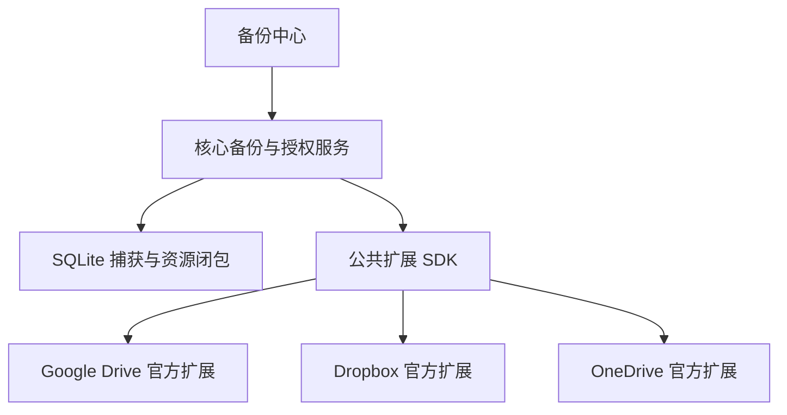
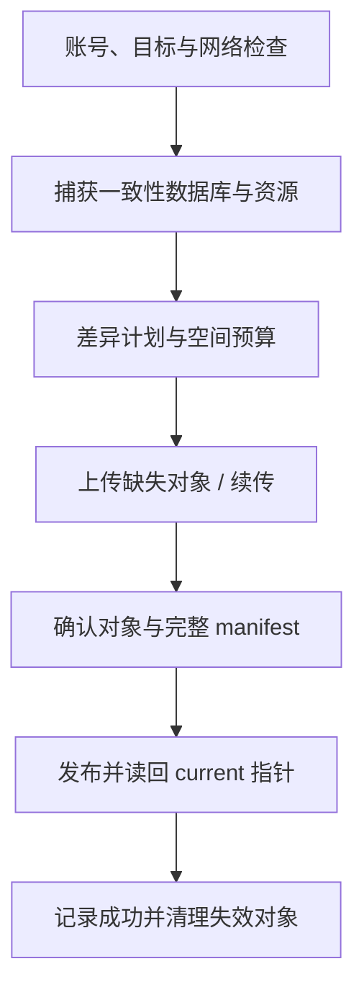

# Anynote 云盘备份设计文档

> 版本：0.2 · 日期：2026-10-09 · 状态：产品与实现设计基线。
>
> 新增需求：核心程序提供云盘备份基础能力；具体云盘对接及备份逻辑通过官方扩展实现。初期支持 **Google Drive、Dropbox、OneDrive**。

## 1. 方案摘要

Anynote 提供统一的备份中心、账号授权入口、任务调度、数据一致性捕获、资源访问、凭据保护、进度和恢复验证。三家云盘分别由独立官方扩展实现，用户选择并启用所需扩展，登录已有云盘账号后即可备份。

云盘备份直接由桌面客户端调用厂商 API，用户登录云盘账号即可配置备份，无需部署服务器。官方负责 OAuth 应用注册、发布所需配置和审核；自编译版本支持填写自己的 OAuth Client ID。

### 1.1 主要决策

| 领域 | 建议 |
| --- | --- |
| 产品入口 | 核心备份中心统一提供“添加云盘” |
| 首期 Provider | Google Drive、Dropbox、OneDrive |
| 实现位置 | 三个官方扩展，独立构建、版本与启停 |
| 数据来源 | 本地 SQLite + 引用附件，网络不影响本地编辑 |
| 用户授权 | 系统浏览器 OAuth Authorization Code + PKCE，后台访问使用 refresh token |
| 数据策略 | 文件级增量：数据库变化后整体上传，未变化附件复用 |
| 初期保留策略 | 每个 Notebook/设备备份槽保留一份当前完整副本 |
| 多设备 | 各设备独立备份槽，可跨设备恢复；不自动合并 |
| 服务端 | 不新增必需的 Anynote 云端服务 |
| 远端提交 | 不可变数据先上传，完整清单后写，最后发布当前指针 |
| 初期加密 | TLS + 凭据安全存储；不宣称端到端加密 |
| 用户可见目录 | 优先应用专用/受限目录，便于识别与管理 |

### 1.2 与现有设计的关系

本文件补充《Anynote 产品与技术设计文档》与《Anynote 本地磁盘备份设计文档》，不改变一个 Notebook 一个 SQLite 的本地布局。

- 本地磁盘备份继续完全离线工作。
- 云盘备份是可选官方扩展，未安装/未登录不影响主应用。
- 当前备份目标包括本地磁盘、Cloudflare，以及 Google Drive、Dropbox、OneDrive 三家云盘；可同时启用，分别显示完成状态。
- 沿用本地备份的文件级增量边界；初期云盘不需要历史增量链。
- 原整体设计中 Cloudflare 的历史保留机制不自动应用到本云盘 Provider。
- 本文确定基础接口与官方扩展责任；仅是设计文档，不代表三家对接已实现、审核通过或完成压测。

## 2. 产品范围与边界

### 2.1 首期范围

连接账号、创建应用备份目录、选择 Notebook、手动/自动备份、文件级增量、上传会话恢复、离线重试、空间/权限异常提示、查看当前副本、校验与恢复、断开连接、显式删除受管备份。

Google Drive 优先 My Drive；Dropbox 优先个人账号与 App Folder；OneDrive 优先个人账号，工作/学校账号在租户策略允许并通过测试后支持。

### 2.2 暂不提供

- 两台设备实时同步、冲突自动合并、协作编辑。
- 网页版 Anynote 或在云盘网页上直接编辑 SQLite。
- 自动导入用户整个云盘内容。
- 任意云盘文件管理、团队盘/共享目录的全面支持。
- 历史增量快照、块级差量、依赖云盘历史版本的恢复。
- 默认备份账号凭据、插件代码、缓存和应用日志。
- 在应用退出后仍由官方服务器持续上传。

**备份与同步的区别**：本地内容向云盘单向更新；其他设备可以恢复当前副本，但不会收到自动合并后的实时笔记。每个备份目标是独立任务，不做跨三个云盘的全局事务。

## 3. 核心与扩展的职责

### 3.1 核心基础能力

| 核心能力 | 具体责任 |
| --- | --- |
| Provider 注册 | 安装、兼容检查、能力描述、启停、错误隔离 |
| 备份中心 | 目标列表、账号状态、统一设置、进度、恢复入口 |
| 账号与凭据服务 | 作用域账号引用、Secret Store、token 刷新协调、退出 |
| OAuth 执行框架 | 浏览器唤起、state/PKCE、回调与超时、请求授权范围校验 |
| 数据捕获 | 一致性 SQLite 临时副本、持久化版本、附件闭包与 pin |
| 资源访问 | 授权 Notebook 内的只读流、范围读取、取消与哈希 |
| 任务调度 | 队列、网络状态、带宽/并发预算、重试状态、暂停/取消 |
| 本机状态 | Provider 会话/游标持久化、崩溃恢复、脱敏日志 |
| 操作约束 | 不允许备份失败修改本地知识数据；删除/清理独立授权 |
| 恢复落地 | 下载结果校验、路径安全、schema 检查、导入新目录 |
| 公共协议工具 | manifest schema、SHA-256、引用验证、可复用文件计划工具 |

核心不写 Google/Dropbox/Graph 的业务分支，不统一假设三家文件命名、分片、哈希和条件更新行为。

### 3.2 官方扩展责任

| 扩展责任 | 具体内容 |
| --- | --- |
| 厂商认证描述 | OAuth endpoint、Client ID、scopes、回调策略、刷新/撤销适配 |
| 账号与目录识别 | 云盘账号 ID、drive/namespace ID、root folder ID |
| 具体备份流程 | 目录布局、差异计划、上传、验证、指针发布、清理 |
| 厂商 API 适配 | 分页、断点续传、文件 ID、版本 token、错误码 |
| 恢复读取 | 枚举备份槽、读取清单、下载数据库与附件 |
| 能力探测 | 可用空间、账号类型、权限、上传会话、条件写与校验 |
| 设置贡献 | 允许的账号/备份目录配置与特定提示 |

三家可以复用官方 `cloud-backup-common` 包的文件级流程，但通过依赖组合实现复用，不能绕过核心公共接口访问 SQLite 或任意磁盘路径。

### 3.3 避免把“基础能力”做成假抽象

核心负责不可绕过的数据保护规则；扩展负责可替换的云盘行为。核心提供捕获与提交证据验证，不替扩展保证所有厂商写操作具有事务。

插件返回“上传完成”不等于备份已完成。核心要求最终清单、对象凭据、提交结果与验证等级，只有满足协议门槛才更新最近成功状态。

## 4. 架构与项目组织



建议在官方 Monorepo 中增加：

```text
packages/
  backup-core/
  cloud-backup-common/
  oauth-broker/
  plugin-sdk/
extensions/
  backup-google-drive/
  backup-dropbox/
  backup-onedrive/
```

- `backup-core` 不依赖任何厂商 SDK。
- `cloud-backup-common` 是首方共享工具，不是强制所有第三方插件使用的业务实现。
- Provider 扩展只能使用公共 SDK 的数据捕获、任务、账号/网络 API。
- 依赖较大的云盘 SDK 懒加载，未启用时不影响编辑器启动。
- 默认可在插件页发现三个官方扩展，也可以随安装包提供；配置目标才激活，不自动索取权限。

## 5. 用户流程与 UI

### 5.1 添加目标

1. 打开设置 → 备份 → 添加目标 → 云盘。
2. 选择 Google Drive、Dropbox 或 OneDrive；未安装则安装官方扩展。
3. 展示扩展来源、将申请的权限、数据存放范围。
4. 点击连接，系统浏览器完成登录和授权。
5. 返回应用，确认账号、应用备份目录、要备份的 Notebook。
6. 设置自动备份频率与网络策略，执行第一次备份。

普通用户登录云盘账号即可使用，不需要填写开发者凭据或 API 地址。自编译/开发者模式的自定义 OAuth 配置置于高级设置。

### 5.2 备份中心

每个目标一张低噪声卡片：厂商品牌图标、账号显示名、权限/连接状态、最近完成时间、当前待传体积、进度、可用空间（若 API 可用）。

主操作：立即备份、恢复、检查；菜单包含暂停、重新登录、打开云盘目录、断开连接、删除备份。账号标识适度隐藏，长技术 ID 不进入正常用户流。

常见状态：等待网络、登录已过期、空间不足、权限不足、上传中、重试中、已完成、备份已更新但清理待重试。

显示例如“本地已保存；Google Drive 待备份”，不把上传状态冒充本地保存状态。三家独立显示，不合成一个掩盖部分失败的绿色状态。

### 5.3 恢复

选择已连接账号 → 列出 Notebook 与备份设备 → 选择当前副本 → 显示时间、大小、条目数和校验状态 → 下载到新工作目录 → 校验与注册。

默认恢复成新 Notebook，不覆盖本地正在工作的库；缺少白板等插件时保留数据并降级预览。

### 5.4 断开连接

断开只停止任务并清除本机 token，不删除远端副本。可调用厂商撤销 API（若适用）并说明可能影响同一应用在其他设备上的授权；无法撤销时给账号安全页入口。

“删除云端备份”是另一个操作，展示目标、Notebook 和设备槽范围后执行；不能把它混入普通退出登录流程。

## 6. 统一授权与开源发布

### 6.1 桌面 OAuth

统一采用系统浏览器 Authorization Code + PKCE（S256）与 state 校验；各扩展声明厂商所支持的回调方式。

- Google 桌面客户端可使用受支持的 loopback 回调，按其桌面 OAuth 配置实现。[G1]
- Dropbox 使用 PKCE 与 refresh token 的后台访问模式；其已注册回调 URI 规则由扩展处理，不假设任意随机端口都被接受。[D1]
- Microsoft 使用公共客户端授权码流程 + PKCE，按 Entra 应用平台配置回调。[M1]

loopback listener 只绑定本机回环地址、短期存活；不监听全部网卡。回调验证 state、会话、预期路径和超时，授权成功后关闭。使用自定义 scheme 时也要验证 state/PKCE，防止回调截获。

厂商页面不放在带有应用 preload 或 Node 权限的 Electron WebView 中。浏览器拒绝、用户取消、授权超时与端口占用均有明确状态。

### 6.2 核心 token broker

核心按 `providerId + OAuthClientId + accountId + tenant/drive context` 存储账号凭据引用，通过操作系统安全存储保存 token。

- Renderer 不持有 refresh token。
- 普通第三方扩展默认通过受限授权请求代理访问，不获得其他 Provider token。
- 首方受信扩展确需厂商 SDK 持有短时 access token 时，由能力授权明确允许；不会因此获得其他账号密钥。
- 同一账号并发刷新使用 single-flight，token 轮换原子保存，响应未含 refresh token 时保留原值。
- access token 过期可刷新；`invalid_grant`/撤销等不可恢复错误转为“需要重新登录”，不无限重试。
- 备份游标、账号配置不写进 Notebook SQLite，避免改变知识数据触发新备份。

### 6.3 官方 OAuth 注册

官方版本使用官方注册的三个 OAuth 应用，配置授权页面、隐私政策、开发/生产状态、重定向与必要审核。开源不意味着用户应自行完成这些手续。

桌面二进制和公开源码无法保密 Client Secret；不得依靠嵌入一个“秘密”保护应用。[G1][D1][M1]

Google 安装应用的凭据格式可能包含 `client_secret`，按官方库/协议使用时它也不是可信保密边界；Dropbox/Microsoft 公共客户端按其 PKCE 流程使用，不把 confidential-client 流程移植到桌面。

Client ID/App Key 是公开应用标识；公开配置不等于 OAuth 授权已生效。自编译使用自己的 ID 需要重新授权，并可能访问不同 app folder/文件范围。跨 OAuth 应用迁移必须设计显式导出/导入或重新授权，不承诺原目录自动可见。

### 6.4 开发与正式发布

开发、测试、生产 OAuth 注册分开。测试账号白名单、开发状态或 refresh token 限制不能作为正式长期备份基线。P0 验证离开授权页面后多次启动、token 过期、撤销、重新授权与第二设备恢复。

企业/学校租户可能限制用户授权或要求管理员批准。扩展报告准确原因，不自动扩大权限或引导用户绕过组织策略。

## 7. 备份格式与当前副本策略

### 7.1 数据捕获

复用核心的一致性 Capture：SQLite Online Backup API 生成临时完整数据库；从该副本读取版本与资源闭包，pin 其引用的不可变附件，之后允许继续编辑。

不能把活跃 `.sqlite`、`-wal`、`-shm` 当三份普通文件独立上传。[C1]

副本含当前笔记、内置历史/回收站及其附件，但不新增“云端历史备份版本”。应用内部笔记历史与备份历史是两种不同能力。

### 7.2 逻辑目录

```text
<provider-app-root>/AnynoteBackup/
  root.json
  notebooks/<notebook-id>/devices/<device-slot-id>/
    current.json
    manifests/<commit-id>.json
    databases/<database-sha256>.sqlite
    assets/sha256/ab/<asset-sha256>.bin
    pending/<task-id>.json
```

这是逻辑布局；Google Drive 用 folder/file ID 映射，Dropbox 用应用根下路径/ID，OneDrive 用 driveId/itemId。不要假设所有 Provider 都具备文件系统路径语义。

每个 device-slot 拥有自己一套受管对象，初期不跨设备共享附件，简化 GC 和授权边界。相同设备备份之间复用附件；不同设备可能存在重复数据，UI 应说明空间代价。

### 7.3 为什么数据对象采用不可变名称

云盘通常没有多文件事务。先上传新哈希数据库、缺失附件和完整 manifest，再切换 `current.json`，避免原地覆盖数据库期间损坏唯一已完成副本。

初期用户可恢复的仍只有 current 指向的完整状态。旧 DB/manifest 仅为正在提交或等待清理的事务过渡数据，成功且完成宽限期后清理，不提供历史备份入口、不构建 delta 链。

`commit-id` 用于幂等、发布和诊断，不代表产品开放历史快照。厂商自身可能保留文件版本/回收站，Anynote 不依赖其期限或把它们计算成自己的历史恢复承诺。

### 7.4 当前指针

```json
{
  "format": "anynote.cloud-backup-head",
  "formatVersion": 1,
  "notebookId": "notebook-uuid",
  "deviceSlotId": "device-slot-uuid",
  "commitId": "commit-uuid",
  "manifestRef": "provider-opaque-reference",
  "manifestSha256": "<64位十六进制哈希>",
  "completedAt": "2026-10-09T03:00:00Z"
}
```

manifest 包含数据库与资源的完整映射、Provider locator、大小、应用 SHA-256、schema/lineage/contentSeq/storageEpoch、资源数量和来源设备。locator 是 Provider 不透明引用，不把临时下载 URL 固化到长期清单。

JSON 示例占位值在正式协议中必须替换为合法字段。大整数按字符串存储；相对路径经过校验；文件名使用 UUID/哈希，避免云盘名称长度和特殊字符问题。

## 8. 文件级增量与任务流程

### 8.1 增量判定

| 内容 | 判定方式 | 上传行为 |
| --- | --- | --- |
| SQLite | 可靠业务/维护版本标记初筛，捕获后 SHA-256 比对 | 有变化则整体上传，无块级差量 |
| 不可变附件 | 入库 SHA-256、远端对象 locator/大小/版本 token | 未变且可确认存在则复用 |
| 引导 JSON/manifest | 确定性内容与哈希 | 必要时更新 |
| 缓存与日志 | 不参与计划 | 不上传 |

无业务变化时不上传新数据库/附件，但仍确认当前指针与重要对象状态。云盘 API 调用量可以非零，不能将“无变化”宣传为零请求。

目标对象被用户删除/移动、file ID 失效或版本 token 异常时重新检查/修复；不能只凭本机旧游标永久认定远端完整。

### 8.2 任务执行



1. 核心获取本机目标槽任务锁，连接指定账号，验证 root 身份。
2. 扩展读取 current 与缓存索引，必要时分页扫描/刷新远端目录。
3. 核心捕获确定的 Notebook 状态，提供只读数据库和资源句柄。
4. 扩展生成缺失对象、传输量、临时空间与发布计划。
5. 限流上传完整 DB 和缺失附件；大文件使用厂商上传会话。
6. 核实上传对象 locator、实际 size 与可用校验结果，生成完整 immutable manifest。
7. 上传并读回 manifest；其资源引用必须全部可解析。
8. 根据 Provider 条件写能力发布 current，读回确认本次 commit；响应丢失时协调，而非重新盲写。
9. 核心仅在协议验证门槛通过后记录成功，之后执行受管 GC。
10. 清理失败只标记待清理，不回滚已经可恢复的备份。

### 8.3 调度与续传

建议自动检查最小间隔 10min，合并连续编辑；用户可配置，手动备份可立即触发。新目标默认先手动授权，完成配置后才启用自动任务。

上传会话保存 `taskId`、源捕获文件身份/哈希、session 引用、过期时间、服务端确认偏移。App 崩溃后必须保留相同数据库临时副本才能续传；文件已丢失或哈希不同则重新捕获并开新会话，不把另一份 DB 拼入旧会话。

离线先等待；session 过期后重传该文件，已完成附件可复用。暂停/取消结束会话或保留可恢复状态，发布临界区先完成可判定状态。

## 9. 多设备、并发与发布安全

### 9.1 首期采用设备槽

同一账号下同一 Notebook：设备 A 更新 A 槽，设备 B 更新 B 槽。每槽只保留当前副本，可在恢复页选择来源设备。

设备槽 ID 存本机，不跟 Notebook 导出包一起复制；新安装/新机器生成新槽。UI 显示用户可命名的设备标签。

该策略避免不同设备共享一个 head，但不提供跨设备同步。每个槽只允许一个客户端写入；目录锁文件和 lastModified 不能被当作可靠的分布式锁。

### 9.2 条件发布

Provider 声明 `conditionalHead`，提供预期版本 token。只有经过实测的 endpoint 行为才可启用，不能把 ETag/version 字段存在当作可以 CAS。

- 支持：冲突即拒绝发布，保留原 head，重新读取并提示。
- 不支持：只允许独立设备槽内单写任务，发布前后检查 head；仍存在外部并发竞态，不能宣称跨客户端原子互斥。
- 当前槽被克隆或出现第二写入者时创建新槽，禁止共享身份继续写。
- 不使用“先读版本再无条件覆盖”冒充强 CAS。

Google Drive 的同名文件可能对应不同 ID，不能按名称取第一项作为 head；出现多个 root/head 候选时检查 UUID 与索引，无法确定则停写。

### 9.3 清理约束

只清理当前槽内、由本应用登记的对象。清理前重新确认 current 未被其他任务改变，并保护进行中任务、恢复下载与尚在提交宽限期的对象。

源不可读、登录失败、分页失败、云盘暂时返回空结果不等于用户删除全部笔记；任何不完整计划禁止清理。

取消勾选 Notebook 或断开账号不自动删除云端副本。用户新增的未知文件不删除，应用目录整棵树不能用作无条件递归清空对象。

## 10. Google Drive 官方扩展

### 10.1 权限与目录

默认建议请求 `https://www.googleapis.com/auth/drive.file`，在 My Drive 创建可识别的 AnynoteBackup 目录，仅处理应用可访问文件，不默认申请全盘 `drive` 或 `drive.metadata.readonly`。[G2]

`drive.file` 是按文件授权模型，不是“选了一个目录就获得所有任意子文件访问”。优先使用同一官方 OAuth 应用创建的备份；其他应用创建/迁移过来的对象需显式授权或格式导入。

`appDataFolder` 可作为后续隐藏模式，但它不在普通云盘 UI 中展示，权限与生命周期也不同。初期不使用它作为唯一用户可见备份存储。[G5]

### 10.2 对象定位与恢复

- 记录 rootFolderId、Notebook folder ID、file ID，不用显示路径作为身份。
- 附带受控 `appProperties` 识别 format、notebook/device/task/hash 等，作为检索索引而非校验凭证。
- 处理同名重复、文件移入回收站、手动移动和应用身份变化。
- 新设备使用相同应用授权后发现既有备份；必须实测 `drive.file` 下的发现/下载闭环。
- 不自动把二进制 DB 转成 Google Docs/Sheets，按原始媒体文件上传和下载。

### 10.3 上传与重试

大文件采用 resumable upload；分片约束遵循厂商要求，Google 的非末尾分片需要按 256KiB 倍数处理。偏移以服务端确认值为准，会话失效后重建。[G3]

创建请求响应丢失时，使用稳定任务身份和厂商可用的 ID/查询机制检查已创建文件，不重复制造同名对象。`current` 内容发布采用经验证的条件机制或单写槽策略。

配额/速率错误按具体 reason 分类，不把所有 403 都当作“token 过期”。分页查询、按 fields 精简响应，避免每个附件一个列表查询。[G4]

### 10.4 首期验收

同账号第二设备恢复、注销重连、目录改名/移动、同名重复、授权撤销、resumable 会话过期、免费空间不足、官方和自定义 Client ID 的隔离行为。

## 11. Dropbox 官方扩展

### 11.1 权限与目录

默认注册 **App Folder** 访问类型，限定应用目录，不要求 Full Dropbox。按需求申请 `files.metadata.read`、`files.content.read`、`files.content.write`，账号/容量显示需要的额外 scope 单独声明。[D1]

桌面使用 PKCE + refresh token，适合后台备份；普通用户不手动生成长期 Access Token。

### 11.2 路径、版本与内容哈希

- 在应用根中用稳定 Notebook/device/hash 目录；同时保留 file ID 和 rev。
- 遵循路径大小写规则，禁止依靠标题大小写区分对象。
- `content_hash` 采用 Dropbox 自己的分块哈希算法，不等同于整文件 SHA-256。[D2]
- 扩展在上传流上计算相应 Dropbox hash 并与远端比对；跨 Provider 的 manifest 始终保存应用 SHA-256。
- 版本 token 用于冲突判断，不能把 rev 当内容哈希。

### 11.3 上传与限流

小文件直接上传，大文件采用 upload session；必要时使用批量 finish 降低同 namespace 写入竞争。支持查询批量提交结果，不能认为“批量请求已接收”就是全部文件提交成功。[D3]

对 `too_many_requests` 按 Retry-After 等待；对 namespace 写入竞争降低提交并发/采用批处理。不固定承诺某个所有账号通用 QPS。

`current` 优先评估使用预期 rev 的条件更新；冲突不自动生成 rename 副本并继续假装唯一 head。首次创建使用禁止覆盖语义，后续以明确 file locator 更新，相关行为通过合约测试锁定。

### 11.4 首期验收

App Folder 范围、scope 缺失、文件 hash、rev 冲突、上传会话恢复、批量异步结果、namespace 限流、用户移动/删除对象、账号重新连接。

## 12. OneDrive 官方扩展

### 12.1 权限与账号

使用 Microsoft Graph 与 delegated 公共客户端授权，优先应用目录 `GET /me/drive/special/approot` 和 `Files.ReadWrite.AppFolder`。[M2]

官方应用目录资料说明该模型适用于家庭与工作/学校 OneDrive。具体上传 endpoint 的权限表不一定与 app folder 概述完全一致：P0 必须实测选定最小权限下的创建、列表、下载、分段上传与删除；不能仅依据 overview 就承诺全部 API 可用。[M2][M3]

若最小权限不足，先查证 endpoint 与 SDK 行为，再给出明确的更高权限选项或限制该账号能力；不得静默追加 `Files.ReadWrite.All`。企业租户管理员策略可能阻止授权。

### 12.2 对象定位与上传

- 用 driveId + itemId 定位，不只保存 `Apps/Anynote` 显示路径。
- 小文件用内容上传 API，大文件使用 createUploadSession；上传会话支持中断恢复。[M3][M4]
- upload session 分片顺序、大小上限与 320KiB 对齐由扩展实现；例如 10MiB 分片满足该对齐要求，不共用 Google 的硬编码参数。[M3]
- `uploadUrl` 是敏感会话凭据，安全保存、不记录日志；向该地址 PUT 片段时按厂商要求不附加 Graph Bearer Authorization。[M3]
- session 过期或消失后重启当前文件上传；不能重复拼接不同捕获数据库。

### 12.3 版本与校验

eTag/cTag 和可用文件 hash 字段按其实际语义使用；不是所有账号/对象都提供应用所需 SHA-256。无可用可信 checksum 时走通用校验等级与下载验证，不把 size/ETag 冒充 SHA-256。

`current` 的条件发布需针对选定 endpoint 验证 If-Match/冲突行为；不借用只在其他更新方法中支持的请求头作推断。

Graph 返回 429 时遵循 Retry-After，并区分鉴权、空间与租户策略失败。[M5]

### 12.4 首期验收

个人账号；受支持工作/学校租户；AppFolder 权限端到端；账号未开通 drive；session 续传/过期；upload URL 凭据处理；eTag 冲突；空间与管理员策略异常。

## 13. 上传验证与恢复完整性

### 13.1 统一哈希与验证等级

应用对数据库和附件统一使用 SHA-256。厂商 checksum 由扩展计算/解释，不能直接互换。

| 等级 | 证据 | UI 表述 |
| --- | --- | --- |
| `provider-checksum` | 远端计算的内容 checksum 与客户端对应算法一致，并绑定 locator/version | 已上传并校验内容 |
| `download-sha256` | 下载指定对象/版本后校验应用 SHA-256 | 已完整校验 |
| `accepted-size` | 厂商上传完成 + 对象存在 + size/version 一致，但无内容 checksum | 已上传，尚未完整校验 |

客户端自写的 appProperties/metadata SHA-256 不属于厂商计算的 checksum，仅是说明信息。

初期要求数据库与 manifest 达到内容验证等级；附件默认优先 Provider checksum，缺失则上传后下载校验。可在高级设置提供“减少重复下载”模式，但必须显示为尚未全量校验，不能把该模式结果混入“全部已验证”。

恢复始终计算应用 SHA-256，与 manifest 比对；哈希不符不注册正常 Notebook。TLS/服务商成功响应不等于应用已验证完整恢复链。

### 13.2 避免重复传输与过高成本

附件入库已知 SHA-256；本地 manifest/index 记录远端 locator 和版本。正常无需每次重算本地所有附件，也不用每次下载所有远端对象。

定期或手动完整校验读取全部对象。远端变更 token、分页索引、厂商 changes/delta/list cursor 可优化检查，但 cursor 失效时回到完整扫描，不能丢失文件存在性检查。

checksum 不足时首次上传后下载验证会增加网络流量，UI 和预算明确体现。完整备份耗时不只由上传带宽决定。

## 14. 失败、中断、清理与幂等

### 14.1 本机状态

在应用数据目录保存：账号引用、root/object ID 映射、device-slot、上传会话、确认偏移、任务切点、current 版本、缓存索引、清理队列。敏感会话 URL/token 进入安全存储或加密本机任务状态。

恢复 Notebook 不携带旧设备槽身份和 token；下一次备份重新确认目标/lineage。

### 14.2 故障行为

| 故障 | 行为 |
| --- | --- |
| 上传一半断网 | 旧 current 不变；有效会话续传 |
| 新附件上传完、DB 失败 | 旧备份保留；完整新附件下次可复用 |
| manifest 失败 | 不发布 current |
| current 成功但响应丢失 | 读取 current 判断 commitId，避免盲目重复写 |
| current 冲突 | 停写，保留双方对象，解释设备槽冲突 |
| 账号空间不足 | 不清理旧当前副本腾空间后强行提交；暂停并提示 |
| 资源被用户删除 | 检查发现后修复；源不存在时报告备份不完整 |
| 远端列表分页中断 | 不生成全删除计划 |
| 源数据库损坏 | 保留远端可能完好的副本，提供恢复 |
| 插件升级/停用 | 保留远端数据，停止新任务；状态迁移可验证 |

上传幂等通过稳定对象身份、任务 ID、厂商 locator 和版本确认实施；不假设三家均接受通用 `Idempotency-Key` 请求头。

### 14.3 垃圾回收

清理只在当前指针确认之后进行，受管对象集合来源于本应用 manifest/任务登记。初期每槽保留 current 引用、进行中任务与恢复 pin；旧 DB/manifest/附件超过协调宽限期后删除。

宽限期是处理在途恢复和提交的技术预算，不是历史恢复承诺。恢复开始应固定读取一个 manifest；单写上传期间旧副本可读，但如果新 current 已发布，旧副本随后可能清理。下载前后检查 current/对象版本，遇缺失则重新选当前副本；不承诺无限时长的跨设备恢复 pin。

若 future 引入跨设备共享对象或长时间远程读锁，必须先增加相应生命周期协议，不直接复用单槽 GC。

## 15. 公共 SDK 草案

### 15.1 Provider 接口

```typescript
interface CloudBackupProvider {
  id: string;
  protocolVersion: number;
  capabilities: CloudBackupCapabilities;
  accountDescriptor: OAuthProviderDescriptor;

  probe(ctx: AccountContext): Promise<TargetCapabilities>;
  ensureTarget(input: TargetInput, ctx: TaskContext): Promise<BackupTarget>;
  plan(input: CapturedBackupInput, ctx: TaskContext): Promise<CloudBackupPlan>;
  execute(plan: CloudBackupPlan, ctx: TaskContext): Promise<PreparedRemoteBackup>;
  verify(input: PreparedRemoteBackup, ctx: TaskContext): Promise<VerificationReport>;
  publish(input: PublishInput, ctx: TaskContext): Promise<CommittedBackup>;
  reconcile(input: ReconcileInput, ctx: TaskContext): Promise<ReconcileResult>;
  listCurrentBackups(ctx: TaskContext): Promise<BackupPage>;
  download(input: RestoreSelection, ctx: TaskContext): Promise<RestoreBundle>;
  cleanup(input: CleanupPlan, ctx: TaskContext): Promise<CleanupResult>;
}

interface CloudBackupCapabilities {
  resumableUpload: boolean;
  conditionalHead: boolean;
  providerChecksum: readonly string[];
  appScopedStorage: boolean;
  quotaAvailable: boolean;
}
```

接口是设计草案；引用类型在 SDK 中定义。能力可以按账号/endpoint 探测覆盖静态描述，不能仅按厂商品牌固定。

### 15.2 核心上下文

```typescript
interface BackupHostContext {
  capture: NotebookCaptureAPI;
  resources: ScopedReadStreamAPI;
  accounts: ScopedAccountAPI;
  http: AuthorizedHTTPAPI;
  tasks: TaskProgressAPI;
  state: ScopedLocalStateAPI;
  verifier: BackupVerificationAPI;
}
```

`TaskContext` 提供 AbortSignal、限流、脱敏日志和进度；`resources` 支持按 offset 读取，便于续传。SDK 不公开任意数据库连接、绝对磁盘路径或全局 token。

### 15.3 扩展 manifest

```json
{
  "id": "anynote.backup.google-drive",
  "name": "Google Drive Backup",
  "version": "0.1.0",
  "engines": {"anynote": "^0.1.0"},
  "runtime": "trusted-first-party",
  "permissions": [
    "backup:capture",
    "assets:read",
    "accounts:google-drive",
    "network:provider-approved"
  ],
  "contributes": {
    "backupProviders": [
      {"id": "google-drive", "kind": "cloud-drive", "formatVersion": 1}
    ]
  }
}
```

这是 Anynote 自定义声明格式，不是现成标准。网络权限最终落到厂商 API/认证域名和上传/下载重定向规则，不能因 `provider-approved` 就允许任意 URL 携带 token。

官方扩展同样只访问用户授权 Notebook。第三方可注册新的 Provider，但各自 OAuth 身份、网络范围与账号数据分离，不能复用官方应用 token。

## 16. 安全与隐私

- 默认不端到端加密；云盘服务端可能读取原始数据库与附件，UI 如实说明。
- 应用权限只用于备份与恢复，不自动访问通讯录、邮件或其他云盘文件。
- token、上传会话、临时 download URL 不进入 Notebook、导出包、日志或遥测。
- 下载重定向采用正确厂商策略，跨域不自动转发 Bearer；session URL 使用厂商要求的认证方式。
- manifest 是远端不可信输入：路径、hash、大小、数量、schema、UUID 全部校验，不执行其中脚本。
- 下载到临时隔离目录，禁止路径逃逸、符号链接与未知插件代码安装。
- 未来客户端加密要版本化 manifest、密钥恢复、续传和对象命名；不将“使用 HTTPS”包装为 E2EE。
- Google/Dropbox/Microsoft 网络可达性由用户环境决定，失败不影响本地编辑，也不自动安装代理。

## 17. 性能、配额与默认策略

默认建议上传文件并发 2，按账号共享预算；厂商可根据实际规则调低提交并发。不能一次对几万个附件同时发请求。

空间预算至少包括旧当前数据库、新数据库、缺失附件与临时 manifest。在确认新 current 前不删除旧当前数据来腾空间。

数据库 100MB、附件 20GB，只改正文时通常只上传新的数据库与小型元数据；新增 5MB 图片则再上传该图片。这是数据量示意，不是各厂商测得的吞吐。

| 开销 | 优化 |
| --- | --- |
| 上传请求数 | 分页索引、对象缓存、批次、正确续传 |
| 无变化检查 | 核心 backupRevision + head/object 状态检查 |
| SQLite 频繁整库上传 | 合并编辑、自动最小间隔、手动立即备份 |
| 小附件多 | 有界并发与厂商批次；以后可评估 pack 格式 |
| 校验流量 | 使用真实 Provider checksum；完整校验按需 |
| 清理数量多 | 分页、受限批次、暂停后幂等继续 |

初期不把全部 Notebook 每次打包成 `.anynote` 上传，否则改一段文字也可能重传全部附件。`.anynote` 保留为用户导出/迁移格式，云盘采用数据库与附件分离的完整清单。

厂商配额、套餐空间、文件上限和速率会变，运行时能力与错误分类优先；文档不固定免费容量、报价或跨账号通用 QPS。

## 18. 测试、实施与发布门槛

### 18.1 P0 必须验证

1. 三家真实桌面 PKCE 授权、刷新、撤销与重新连接。
2. 官方 OAuth 发布路径、生产限制与必要审核。
3. 最小 scope 下创建、发现、上传、下载、删除、第二设备恢复。
4. 特别验证 OneDrive AppFolder 与所选分段上传 endpoint 权限组合。
5. Google 同名/ID、Dropbox hash/rev、OneDrive session/版本行为。
6. 各 Provider 的条件 head 能力；不满足时落实单写设备槽。

### 18.2 Provider 合约测试

- 没有变化不上传新数据库/原附件。
- 新增附件只上传新文件与数据库。
- 上传失败、manifest 失败均不改变可恢复 current。
- publish 响应丢失可判定结果且不会误清理。
- 全分页读取失败不产生删除计划。
- token 轮换、空间不足、429/Retry-After 正确处理。
- 上传会话偏移采用远端确认值，换 DB 不继续旧 session。
- 手动删除/移动远端文件被发现；恢复校验损坏不会注册正常 Notebook。
- 卸载扩展不删除远端数据，更新不泄漏凭据。
- 跨设备只读恢复能从新的授权环境完成，不依赖原机器 file ID 缓存。

### 18.3 发布路线

| 阶段 | 交付 |
| --- | --- |
| P0 | OAuth/权限/上传/checksum/发布实验，确定能力矩阵 |
| P1 | 核心 SDK、备份中心、token broker、共同文件格式 |
| P2 | Google Drive Provider 完整上传与恢复闭环 |
| P3 | Dropbox/OneDrive Provider 与同一套合约测试 |
| P4 | 续传、清理、异常 UI、真实容量与故障演练 |
| P5 | 正式 OAuth 应用发布、兼容矩阵、用户文档 |

每家只有完成真实备份→干净设备恢复与异常测试，才显示为稳定支持。开发中 Provider 标记 Beta，不能用统一 UI 暗示三家兼容性完全相同。

## 19. 设计决策清单

| 问题 | 决策 |
| --- | --- |
| 核心是否内置三家 API | 否，API 与具体流程在官方扩展 |
| 核心是否提供账号、调度和恢复 | 是，统一基础服务与数据保护约束 |
| 普通用户是否配置开发者密钥 | 否，官方版本预配置应用身份 |
| 是否新增必需官方服务器 | 否，桌面直接调用云盘 |
| 是否做实时同步 | 否，仅备份/恢复 |
| 初期是否保留云端历史快照 | 否，每设备槽一份当前副本 |
| 是否原地覆盖唯一数据库 | 否，不可变对象先准备，current 后发布 |
| 是否把 ETag/rev 当 SHA-256 | 否，各 Provider 明确语义 |
| 是否将数据库与附件一起每次打包 | 否，分离上传以复用附件 |
| 是否依赖跨文件 rename 原子事务 | 否，云盘没有统一目录事务假设 |
| 多设备是否共享写入槽 | 否，初期独立槽避免覆盖 |
| 断开是否删除云端备份 | 否，删除是独立显式操作 |

## 20. 官方资料

核实日期：2026-10-09。以下资料支持厂商能力与限制；接口、布局、默认值与发布路线是 Anynote 的设计建议。实现时锁定 SDK 版本并再次检查当前文档。

| 编号 | 官方资料 | 用途 |
| --- | --- | --- |
| G1 | [Google OAuth for Desktop Apps](https://developers.google.com/identity/protocols/oauth2/native-app) | PKCE、桌面回调、公开客户端边界 |
| G2 | [Google Drive scopes](https://developers.google.com/workspace/drive/api/guides/api-specific-auth) | drive.file 与最小权限 |
| G3 | [Google Drive uploads](https://developers.google.com/workspace/drive/api/guides/manage-uploads) | resumable upload |
| G4 | [Google Drive usage limits](https://developers.google.com/workspace/drive/api/guides/limits) | 配额与重试 |
| G5 | [Google Drive application data](https://developers.google.com/workspace/drive/api/guides/appdata) | appDataFolder 边界 |
| D1 | [Dropbox OAuth guide](https://docs.dropboxapi.com/dropbox-api/docs/oauth) | App Folder、PKCE、refresh token |
| D2 | [Dropbox Content Hash](https://docs.dropboxapi.com/dropbox-api/docs/technical-reference/content-hash) | 厂商校验算法 |
| D3 | [Dropbox Performance guide](https://docs.dropboxapi.com/dropbox-api/docs/performance) | namespace、上传会话、限流 |
| M1 | [Microsoft Authorization Code flow](https://learn.microsoft.com/en-us/entra/identity-platform/v2-oauth2-auth-code-flow) | 公共客户端与 PKCE |
| M2 | [OneDrive App Folder](https://learn.microsoft.com/en-us/graph/onedrive-sharepoint-appfolder) | AppFolder 与账号范围 |
| M3 | [Graph createUploadSession](https://learn.microsoft.com/en-us/graph/api/driveitem-createuploadsession?view=graph-rest-1.0) | 权限、分片、会话凭据 |
| M4 | [Graph upload file content](https://learn.microsoft.com/en-us/graph/api/driveitem-put-content?view=graph-rest-1.0) | 小文件上传 |
| M5 | [Graph throttling](https://learn.microsoft.com/en-us/graph/throttling) | 429 与 Retry-After |
| C1 | [SQLite Online Backup API](https://www.sqlite.org/backup.html) | 一致性数据库捕获 |

