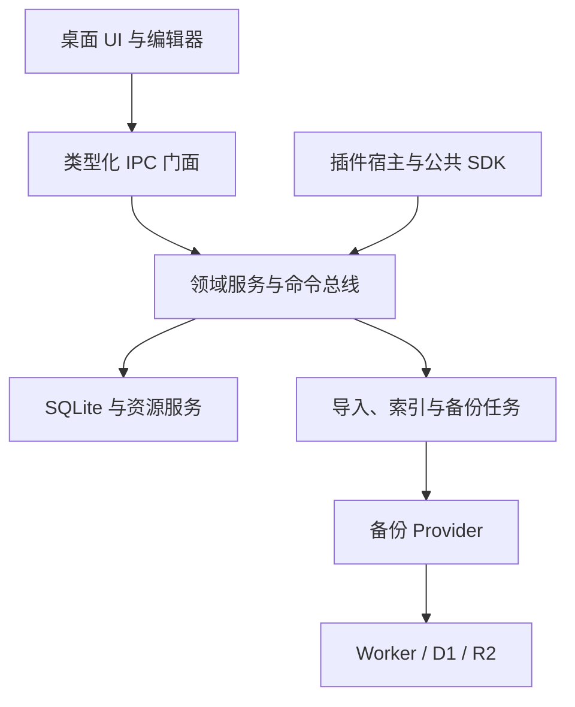
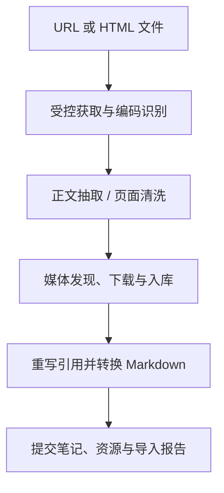

# Anynote 产品与技术设计文档

> 版本：0.1 · 日期：2026-10-01 · 状态：建议设计基线，供产品、设计与研发评审。
>
> 产品定位：以 Notebook 为边界、本地优先、可扩展的个人知识库。支持 Markdown、PDF、图片，将日常记录、网页收藏、资料阅读和知识整理放在一个安静、美观、可靠的桌面空间里。

## 1. 方案摘要

Anynote 使用 Electron 构建桌面客户端；每个 Notebook 独立持有一个 SQLite 数据库与一组附件文件。所有读写首先发生在本地，网络中断不影响编辑、搜索、阅读和导出。

主应用提供 Notebook、目录树、文档生命周期、资源管理、命令系统、插件宿主和基础 UI。编辑器扩展、网页导入、备份后端、AI 与后续 OCR 等能力通过独立包或插件提供。建议先采用 pnpm monorepo 管理多个可独立构建、发布的项目，再按团队与权限需要拆分仓库。

### 1.1 核心决策

| 领域 | 建议方案 | 原因与边界 |
| --- | --- | --- |
| 桌面客户端 | Electron + React + TypeScript + Vite | 桌面文件能力完整，复用 Web 编辑生态；无需引入 Next.js |
| Notebook 存储 | 一个 Notebook 一个 SQLite + 私有资源目录 | 可单独迁移、备份、导出和恢复 |
| 笔记目录 | 逻辑无限层级目录；统一节点树 | 目录深度不绑定操作系统路径长度 |
| Markdown | 扩展 Markdown 为持久化真源，编辑器模型为派生数据 | 保留可读性、源码模式、开放导出能力 |
| 文档编辑 | Tiptap/ProseMirror 富文本模式 + CodeMirror 6 源码模式 | 支持文档块、扩展节点与传统 Markdown 编辑 |
| 白板 | 首方 Excalidraw 插件 | 白板场景文件本地保存，静态预览可降级 |
| PDF | PDF.js 阅读器，批注独立存储 | 原始 PDF 保持不可变；先做阅读、高亮与批注 |
| 本地搜索 | SQLite FTS5 + 中文分词适配 | 基础全文检索不依赖远程服务 |
| Cloudflare 备份 | Worker API + D1 元数据/结构化记录 + R2 正文对象/附件 | 采用逻辑增量，不把 D1 当本地 SQLite 文件镜像 |
| 导入/导出 | `.anynote` 私有 ZIP 容器 | 包含一致性数据库、全部持久化资源与校验清单 |
| 扩展系统 | 公共 SDK + 声明式扩展点 + 隔离运行时 | 核心可控，能力可选，插件不直接修改数据库 |
| AI | 受权限控制的工具 API + 变更提案与撤销 | AI 通过与用户相同的领域服务操作笔记 |
| UI | 温暖中性底色、低噪声侧栏、阅读优先、可收起辅助面板 | 美观来自排版、层次与一致性，避免后台管理台风格 |

### 1.2 必须明确的产品边界

1. **备份不等于同步**：第一版提供自动备份、历史版本、灾难恢复；不承诺两台设备实时合并同一 Notebook。
2. **文件级增量不等于 SQLite 页级增量**：增量备份只跳过未变化的实体与附件，发生变化的数据库快照整体上传。真正的页级或分块增量作为后续优化。
3. **Markdown 不天然表达全部在线文档能力**：白板、视频等采用 Anynote 明确的扩展语法。未来复杂表格、布局、评论也必须定义持久化协议，不能只保存在编辑器 JSON 中。
4. **本地优先不等于默认加密**：v1 提供操作系统凭据保护与传输加密；端到端加密为独立后续能力，不能将普通 D1/R2 存储描述为端到端加密。
5. **无限嵌套是逻辑能力**：模型不设产品层级上限，运行时仍有查询、渲染和输入预算，防止极端数据卡死。

## 2. 用户需求与使用场景

### 2.1 核心用户任务

| 场景 | 用户操作 | 期望结果 |
| --- | --- | --- |
| 整理主题知识 | 建 Notebook，按目录整理笔记 | 每个主题形成独立、可迁移的知识库 |
| 自由记录 | 输入 Markdown、拖入图片、插入白板或视频 | 流畅编辑，不必反复切换工具 |
| 收藏网页 | 粘贴网页链接或导入 HTML 文件 | 正文转为 Markdown，可下载媒体本地化 |
| 阅读资料 | 导入 PDF、查看图片、做批注 | 原文件完整保存，批注与知识笔记关联 |
| 离线工作 | 无网络启动、搜索、编辑 | 核心功能正常，待备份状态清晰 |
| 数据保护 | 配置 Cloudflare 备份目标 | 自动增量备份，可验证和恢复历史版本 |
| 扩展能力 | 安装编辑器、备份、AI 插件 | 按需增强，插件停用不破坏现有数据 |
| AI 整理 | 让 AI 总结、分类、修改、建立关联 | 先展示修改方案，应用后可追溯和撤销 |

### 2.2 范围划分

**v1 范围**：桌面应用；本地 Notebook；目录树；三种笔记；双模式 Markdown；白板与 YouTube 链接；网页/HTML 导入；搜索、标签、内部链接；本地快照；Cloudflare 备份；完整导入导出；基础插件 SDK；AI 工具接口预留。

**后续范围**：多设备同步、移动端、多人协作、OCR、语义检索、完整 PDF 写回、复杂多列布局、数据库表格视图、插件市场、端到端加密。

## 3. 概念模型与信息架构

### 3.1 主要对象

| 对象 | 定义 |
| --- | --- |
| Workspace | 本机应用工作空间，记录已打开 Notebook 与全局设置；不是知识数据容器 |
| Notebook | 主题知识容器；拥有自己的 UUID、SQLite、资源、版本与备份配置引用 |
| Folder | Notebook 内的逻辑目录，可无限嵌套 |
| Note | Markdown、PDF 或图片笔记；有标题、目录、标签、版本和元信息 |
| Asset | 本地不可变二进制对象，如图片、PDF、音视频、白板 JSON |
| Resource | 一个逻辑资源身份，指向某个 Asset，可通过新版本换绑 |
| Revision | 笔记或其他实体的一次不可变版本 |
| Backup generation | 一个可恢复的备份版本，包含确定的数据库或逻辑状态及资源集合 |
| Extension | 通过公共扩展点增加应用能力的插件 |

### 3.2 Notebook 与目录

- Notebook 之间严格隔离。跨 Notebook 链接可以存在，默认不把另一个 Notebook 的内容纳入导出。
- Folder 与 Note 共用 `nodes` 节点表；只有 Folder 可作为父节点。
- Note 本身不承载子目录。未来若要支持“页面内子页面”，通过独立产品决策引入，避免初期混淆目录与文档块。
- 节点名称可重名，身份由 UUID 决定；显示路径不参与资源定位。
- 拖拽移动必须校验同一 Notebook、合法父类型与无循环；目录删除进入回收站并覆盖整个子树。
- 首版跨 Notebook 移动采用“复制成功后再将源放入回收站”，不假设两份数据库之间有原子事务。

### 3.3 应用导航

左侧主要入口：Notebook 切换、搜索、最近、收藏、Notebook 目录树、标签、回收站。

上方：可隐藏文档标签页、前进/后退、面包屑、标题、笔记操作与辅助面板入口。

右侧：按需展示大纲、属性、反向链接、AI；每次默认显示一个辅助面板，支持固定，不同时堆叠多个窄栏。

全局命令面板提供创建、打开、移动、导入、插入块、运行插件命令与切换主题等入口。

## 4. 系统架构



### 4.1 Electron 进程职责

| 进程 | 职责 | 禁止事项 |
| --- | --- | --- |
| Main | 窗口、菜单、系统对话框、协议注册、凭据代理、进程调度 | 大批量解析、同步数据库操作阻塞 UI 生命周期 |
| Renderer | React UI、文档编辑、阅读器、交互状态 | 直接文件读写、数据库连接、任意 Node 调用 |
| Preload | 暴露精简类型化 API，转发经过校验的 IPC | 暴露整个 `ipcRenderer`、任意频道或 shell |
| Storage Utility Process | 持有数据库连接，串行写入，快照、资源读写 | 接受未经校验的 SQL 或任意路径 |
| Task Process/Worker | HTML 转换、PDF 文本抽取、资源哈希、索引、备份 | 与 UI 共用长任务线程 |
| Extension Host | 执行扩展业务逻辑，调用能力 API | 默认为插件开放文件系统、网络或凭据 |

Electron 的 `utilityProcess` 可用于有 Node 能力的后台任务，但它不是不可信插件的权限沙箱。普通 Node 子进程同样不能阻止 `fs` 或网络访问。安全设计必须区分进程隔离与权限隔离。[S1][S2]

### 4.2 核心层次

1. **Domain**：实体、校验、不变量、领域命令，不依赖 Electron/Cloudflare。
2. **Application**：Notebook、Note、Asset、Search、Import、Backup、AI 操作服务。
3. **Ports**：Storage、BackupProvider、Importer、EditorAdapter、AIProvider。
4. **Adapters**：SQLite、Electron IPC、Cloudflare、Tiptap、PDF.js。
5. **Presentation**：桌面 Shell、编辑器视图、设置、恢复向导。

服务通过接口组合，UI 不判断当前使用哪个备份厂商。网络 Service 仅处理请求，业务流程留在 Application 层。

### 4.3 推荐依赖与使用原则

| 模块 | 推荐 | 约束 |
| --- | --- | --- |
| UI | React、Tailwind、Radix/shadcn 基础组件、Lucide | 二次设计统一样式；不直接拼出默认组件展示页 |
| UI 状态 | Jotai；异步查询可使用 TanStack Query | SQLite 是真源，前端缓存不另建业务状态真源 |
| 本地数据库 | better-sqlite3，放在存储进程 | Electron ABI 与平台架构打包验证；对外仍暴露异步 API |
| SQL/迁移 | Drizzle 或显式 SQL Repository | 选一套；本地和 D1 迁移独立，避免假设完全兼容 |
| 校验 | Zod 或 JSON Schema | IPC、插件 manifest、导入格式、远程协议必须校验 |
| 编辑器 | Tiptap/ProseMirror、CodeMirror 6 | 上层封装 EditorAdapter，固定版本并做回归 |
| Markdown 编译 | 源码位置感知 AST 层，可评估 unified/remark | 负责扩展语法和未知节点保留，不依赖编辑器自动无损往返 |
| HTML 导入 | Readability、Turndown、DOMPurify | 抽取、转换、清洗分工明确 |
| PDF / 白板 | PDF.js / Excalidraw | 懒加载；白板数据协议由 Anynote 适配层版本化 |
| Cloudflare API | Workers + Hono + D1 + R2 | API 使用稳定协议，避免暴露 Cloudflare 管理凭据 |

以上为技术推荐而非已完成兼容验证。立项时锁定依赖与许可证，尤其注意编辑器商业扩展、字体分发与插件再分发边界。

## 5. 本地存储与一致性

### 5.1 Notebook 文件布局

```text
<notebook-root>/
  notebook.json
  notebook.sqlite
  assets/
    sha256/ab/<64位哈希>.bin
  snapshots/
    <generation-id>/notebook.sqlite
    <generation-id>/manifest.json
  cache/
    thumbnails/
    pdf-text/
    editor/
  temp/
  locks/
```

`notebook.json` 是轻量引导文件，包含格式版本、Notebook UUID、显示名缓存、数据库文件名。UUID 与显示名以数据库为权威；启动时校验并修复缓存。重命名不改资源路径。

SQLite WAL 模式运行时会出现 `notebook.sqlite-wal` 与 `-shm`。这属于正常运行文件，不能把活跃 `.sqlite` 文件单独复制后称为完整备份。[S3][S4]

全局设置和 Notebook 注册表可放在用户数据目录的 JSON 文件中；本机任务状态、Provider 游标与凭据引用也放在应用数据目录，避免备份进度改变 Notebook 内容后触发新的备份。知识业务数据不跨 Notebook 合并到一个全局数据库。

### 5.2 数据持久化原则

- 小型结构化数据、Markdown 正文、批注、引用、逻辑资源元信息存 SQLite。
- PDF、图片、音视频、白板场景文件等非结构化资源存 `assets/`。
- Asset 不可变，更新产生新哈希，历史 Revision 可以继续引用旧对象。
- 哈希去重限于同一 Notebook。全局物理去重需额外共享生命周期机制，首版不做。
- 文件名扩展名不作为类型依据；保留 MIME、原文件名与内容探测结果。
- 缩略图、编辑器 JSON 缓存、搜索索引、向量索引属于可重建数据；导出无需携带缓存目录。

### 5.3 数据库与文件的写入协议

数据库事务不能与文件系统原子提交，必须使用明确顺序：

1. 将新资源流式写入 `temp/`，计算 SHA-256，检查长度、类型和配额。
2. flush 并在同一文件系统原子 rename 到内容寻址路径；已存在同哈希对象则验证后复用。
3. 开启 SQLite 事务，创建 Asset/Resource、笔记版本、资源引用、变更日志，提交。
4. 提交成功后发事件、更新 UI；提交失败则留下可回收孤儿文件，不产生悬空引用。
5. 启动扫描检查临时文件、孤儿对象、缺失资源；缺失资源展示“资源损坏/待恢复”，不得静默当作正常笔记。

删除采取相反思路：先事务更新引用与软删除，物理文件延迟 GC。GC 必须同时检查活跃笔记、历史版本、回收站、本地快照和正在导出/备份的 pin，不能只看当前页面。

### 5.4 SQLite 配置与连接

- 启用 `foreign_keys=ON`、`journal_mode=WAL`，配置 `busy_timeout`。
- 初版优先 `synchronous=FULL`；性能优化必须明确断电耐久性代价。
- 每个 Notebook 单写队列；多窗口通过同一存储服务写入。
- 一个本地 Notebook 路径只允许一个应用实例持有写锁，第二实例只读或跳转原实例。
- 原始 Notebook 不建议置于网盘自动同步目录或网络文件系统；应用自己负责备份与远程恢复。
- 连接数采用 LRU 管理，不能为了全局搜索同时打开所有 Notebook 连接。
- 磁盘满、只读目录、数据库锁定必须有可操作的错误提示；编辑草稿保留并支持另存/导出。

## 6. 数据模型

### 6.1 核心表

| 表 | 关键字段 | 说明 |
| --- | --- | --- |
| `notebook_meta` | id、name、schema_version、content_seq、created_at | 单行 Notebook 元信息 |
| `nodes` | id、parent_id、kind、title、sort_key、revision、deleted_at、deleted_by | Folder/Note 统一树 |
| `notes` | node_id、note_type、head_revision_id、primary_resource_id、source_uri | 三种笔记共有信息 |
| `note_revisions` | id、note_id、parent_revision_id、format、body、content_hash、created_at、actor | 不可变笔记版本，正文或类型化状态 |
| `assets` | hash、size、mime_type、relative_path、created_at | 物理不可变资源 |
| `resources` | id、asset_hash、role、original_name、metadata_json、revision | 稳定逻辑资源身份 |
| `revision_resources` | revision_id、resource_id、asset_hash | 固定某一版本实际使用的资源哈希 |
| `annotations` | id、note_id、target_asset_hash、kind、selector_json、body、revision、deleted_at | PDF/图片批注 |
| `tags` / `note_tags` | id、name / note_id、tag_id | 标签与绑定 |
| `note_links` | source_note_id、target_notebook_id、target_note_id、anchor、revision_id | 可重建链接索引 |
| `changes` | seq、entity_type、entity_id、entity_revision、operation、payload_json | 追加式业务变更日志，备份/事件依据 |
| `extension_data` | extension_id、key、value_json、schema_version、revision | 持久化插件数据的命名空间 |
| `history_pins` | scope、target_id、expires_at | 防止正在使用的历史资源被清理 |
| `fts_notes` | note_id、title_tokens、body_tokens | 可重建全文索引 |

所有知识数据的修改，包括标题、排序、标签、批注、插件持久化状态，都要更新版本并写 `changes`。只有编辑器缓存、阅读滚动位置等本机状态可以不参与备份。

### 6.2 关键 SQL 示例

```sql
CREATE TABLE nodes (
  id TEXT PRIMARY KEY,
  parent_id TEXT REFERENCES nodes(id),
  kind TEXT NOT NULL CHECK (kind IN ('folder', 'note')),
  title TEXT NOT NULL,
  sort_key TEXT NOT NULL,
  revision INTEGER NOT NULL DEFAULT 1,
  created_at INTEGER NOT NULL,
  updated_at INTEGER NOT NULL,
  deleted_at INTEGER,
  deleted_by TEXT
);
CREATE INDEX idx_nodes_parent_order ON nodes(parent_id, sort_key, id);

CREATE TABLE notes (
  node_id TEXT PRIMARY KEY REFERENCES nodes(id),
  note_type TEXT NOT NULL CHECK (note_type IN ('markdown', 'pdf', 'image')),
  head_revision_id TEXT,
  primary_resource_id TEXT,
  source_uri TEXT
);

CREATE TABLE changes (
  seq INTEGER PRIMARY KEY AUTOINCREMENT,
  entity_type TEXT NOT NULL,
  entity_id TEXT NOT NULL,
  entity_revision TEXT NOT NULL,
  operation TEXT NOT NULL CHECK (operation IN ('upsert', 'delete')),
  payload_json TEXT NOT NULL,
  created_at INTEGER NOT NULL
);
CREATE INDEX idx_changes_entity ON changes(entity_type, entity_id, seq);
```

以上是说明性片段，不是最终可运行的完整 schema。父节点必须为 Folder、无环等条件由领域服务在写事务中验证；可增加触发器兜底。`notes.head_revision_id` 的外键、资源表和批注表需在完整迁移中补齐。

### 6.3 树结构与排序

采用邻接表 `parent_id`，查询子项使用分页索引，查询祖先/子树使用递归 CTE。树 UI 用显式栈与扁平可见列表，避免递归组件因极深目录栈溢出。

移动目录时遍历目标祖先，确认目标不在源子树内。首版暂不增加闭包表；大量子树统计确有瓶颈时再加可重建路径缓存。

`sort_key` 使用稳定的分数排序字符串；查询始终加 `id` 作为并列排序。键变长后只重排同一目录，重排也写入业务变更。常用计数缓存不能成为权威数据。

删除目录写入一个删除操作 ID 并标记整个子树；恢复只恢复同一删除操作产生的节点，防止把更早已删除的子项也恢复。原父目录不存在时提示恢复到 Notebook 根目录。

### 6.4 版本与草稿

- 编辑器内存状态实时更新；建议 500–800ms 防抖本地保存、切换笔记/失焦立即 flush。
- 中文 IME 组合输入期间不切模式、不替换文档；组合结束再保存。
- 每次持久化事务保证正文、引用、head 与变更日志一致。
- 历史面板可把连续输入版本折叠显示；后台压缩只能在备份游标、快照 pin 与历史策略允许后进行。
- “已保存”只在本地提交成功后显示；云备份独立显示“待备份/已备份至版本 X”。
- 渲染进程崩溃可恢复最近一次成功持久化内容，防抖窗口内草稿可能丢失；可后续增加轻量草稿日志降低风险，不宣称绝对零丢失。
- 保存使用 `expectedRevision` 乐观锁；另一个窗口已修改时产生冲突提示或保留副本，不直接覆盖。

## 7. Markdown 与文档编辑器

### 7.1 存储真源

Markdown 笔记在 SQLite 保存 UTF-8 扩展 Markdown 文本，称为 **Anynote Markdown 1**。标准部分优先 CommonMark + 明确选定的 GFM 子集，扩展部分使用有版本的指令块与资源引用协议。

ProseMirror/Tiptap JSON 只作为编辑器派生模型，可以缓存，缓存失效时从正文重建。若未来增加无法可靠映射到协议的在线文档能力，必须先扩展文档协议，不能悄悄把 JSON 升格为另一份真源。

源码模式与富文本模式不能分别独立写不同正文；一个编辑会话只有一个活跃模式，切换先 flush、校验、转换，再更新模式。

### 7.2 双模式方案与无损边界

**富文本模式**提供段落块、选区菜单、斜杠菜单、块拖拽、图片缩放、表格、折叠块、白板和视频卡片。

**源码模式**由 CodeMirror 6 提供语法高亮、行号可选、搜索替换、快捷格式化和预览。

Tiptap 官方 Markdown 功能支持双向转换与扩展 tokenizer，但当前文档标记为 Beta，并说明评论和复杂表格等限制。因此不能直接承诺“任意 Markdown 经过 JSON 往返原样不变”。[S5]

Anynote 适配层承担以下职责：

1. 用源码位置感知 AST 保存原始块文本与范围；富文本局部编辑只序列化受影响的块，避免重写整篇。
2. 未修改区域保留原字节；修改区域可规范化，允许列表缩进、强调分隔符等文本形式变化，但不能丢语义。
3. 不支持的 Markdown/HTML/指令块进入 `opaque` 节点，保留原文并显示只读占位，不透传为可执行 HTML。
4. 如果适配器不能安全表示某结构，提示使用源码模式；复杂文档先只读富文本，不能以“修复文档”名义删除内容。
5. 发布前验证嵌套列表、表格、代码围栏、转义、脚注、未知插件块等语料。无法完成可靠局部回写时，先上线源码编辑+渲染预览，富文本模式继续 Beta。

### 7.3 扩展 Markdown 语法

```markdown
# WebRTC 学习笔记

普通图片：


内部链接：
[TURN 与 SFU](anynote://notebook/notebook-uuid/note/note-uuid)

:::anynote{type="core.whiteboard" version="1" id="block-uuid"}
{"resourceId":"board-resource-uuid","previewResourceId":"preview-resource-uuid"}
:::

:::anynote{type="core.video" version="1" id="block-uuid-2"}
{"provider":"youtube","url":"https://www.youtube.com/watch?v=VIDEO_ID","startSeconds":0}
:::
```

规范要求：

- 该语法是 Anynote 私有扩展，不是通用 Markdown 保证支持的语法。
- `type` 使用命名空间，`version` 是该节点格式版本；`id` 用于块身份、AI patch 与定位。
- 指令内容是经过校验的 JSON；规定围栏转义与闭合规则，避免正文中 `:::` 导致提前结束。
- 资源 URL 是持久化的逻辑标识；运行时通过 Notebook 上下文解析为受控协议，不将绝对磁盘路径写入正文。
- 普通段落的稳定块 ID 可保存在 Revision 侧表中；源码编辑后无法匹配时重新分配并使旧 AI patch 失效。
- 扩展属性携带未知字段时保留，版本高于当前插件支持范围则只读。

### 7.4 扩展能力矩阵

| 能力 | v1 | 持久化方式 | 无插件降级 |
| --- | --- | --- | --- |
| 标题、列表、引用、代码、链接 | 内置 | 标准 Markdown | 标准显示 |
| GFM 表格、任务列表、删除线 | 内置 | GFM | 标准/简化显示 |
| 图片 | 内置 | 逻辑资源引用 | 图片或缺失占位 |
| 白板 | 首方插件，默认启用 | 指令块 + 场景 JSON + 资源 + 预览 | 静态预览与下载原数据 |
| 视频链接 | 首方插件，默认启用 | 指令块 + URL/元信息 | 普通链接卡片 |
| Callout、折叠、数学公式 | 下一批可选扩展 | 明确协议或约定 Markdown 语法 | 原始块/文本 |
| 多列布局、复杂表格、评论 | 后续 | 新版本协议 | 只读保留 |

### 7.5 白板

- 插入时创建稳定白板 Resource；编辑完成后保存新的不可变场景 Asset，并更新 Resource 指向。
- 场景内引用的图片单独入库，使用资源 ID；场景 JSON 中保留 Anynote 资源映射。不能只备份场景 JSON 而遗漏图片。
- 编辑器内展示适合正文宽度的预览；点击进入宽屏白板编辑层，支持返回正文与明确保存状态。
- 预览 PNG 与场景版本绑定；离线、停用插件或第三方渲染失败时仍能查看。
- 导出静态 Markdown 时生成白板预览图片，并链接原场景数据。
- 白板格式升级只生成新版本，不改写所有历史文件。适配器负责 Excalidraw 格式与 Anynote 格式之间的转换。[S6]

### 7.6 视频链接

- 首版支持 YouTube 链接识别，也允许通用视频 URL 卡片。
- 粘贴链接后默认显示卡片，用户选择“嵌入播放”；离线显示本地缓存缩略图与标题。
- URL 规范化只接受已支持 provider 的安全地址与合法视频 ID；不保存任意 iframe HTML。
- 嵌入播放位于无 preload、无 Node 的隔离远程视图，受域名、导航与权限规则限制。
- 点击播放才联网；Notebook 可关闭所有远程嵌入。
- 视频链接不等于完整视频已下载。首版不实现 YouTube 视频下载；本地化范围为元信息/可获取缩略图。普通可下载媒体可按第 9 节处理。

## 8. PDF 与图片笔记

### 8.1 PDF

PDF 原件存本地资源目录，PDF 笔记引用主 Resource；支持分页阅读、缩放、页缩略图、文内查找、文字选择、页码跳转、阅读位置记忆。[S7]

批注单独保存，结构包括：`targetAssetHash`、页码、归一化矩形、文字片段、前后文、颜色、批注正文、作者与版本。原 PDF 变更后，批注不自动套用到新哈希文件，需重新锚定或保持旧版本。

支持由选中文字创建关联 Markdown 笔记，并保存返回 PDF 页码与批注位置的链接。

PDF 文本抽取异步执行；扫描 PDF 没有文本时显示“OCR 未启用”。OCR 插件以后生成可重建检索文本，不替换原 PDF。加密 PDF 的解密密码不写入导出包或云端元信息。

首版不实现任意 PDF 编辑与原文件批注写回。若后续提供导出带批注 PDF，必须作为新文件输出，并核验渲染、坐标与字体。

### 8.2 图片

图片笔记包含原图、标题、说明、标签与可选批注。支持缩放、适应窗口、实际尺寸、旋转查看与 EXIF 信息；查看旋转是视图状态，修改图像则生成新 Asset。

SVG 默认清洗并栅格化预览，原文件可保存；不得将未经清洗的 SVG/HTML 当作受信应用代码执行。超大图像使用缩略图与分辨率分级，避免一次解码挤占内存。

## 9. HTML / 网页转 Markdown

### 9.1 导入入口

- 粘贴 HTTP(S) 链接，预览标题、目标 Notebook/目录、预计媒体数，再导入。
- 选择 HTML 文件，可同时授权其相邻资源目录；支持相对路径图片和其他附件。
- 提供“正文模式”和“尽量保留页面内容模式”。正文模式优先提取文章，页面模式不承诺复刻 CSS 排版。
- 导入任务可取消、重试和查看失败资源；Notebook 页面不用等待全部任务结束才能继续使用。

### 9.2 处理管线



1. 获取 HTML，保留来源 URL、最终 URL、获取时间、标题和可选原始 HTML 资源。
2. DOM 解析禁用脚本与自动外部资源加载。正文提取使用 Readability；失败可退回经过清洗的页面内容。[S8]
3. 转换前收集媒体，必要时同时扫描正文和原 DOM，以处理 Readability 清理掉的懒加载属性。
4. 清洗 `script`、事件属性、危险 URL 与未允许的 iframe；Readability 本身不是安全清洗器。[S8]
5. 下载媒体到本地，计算哈希并去重，重写为 `anynote-resource:` 引用。
6. 使用 Turndown 与自定义规则处理代码、表格、任务列表、链接、媒体、数学片段。[S9]
7. 预览转换结果并生成导入报告；提交一组有资源完整性保证的笔记状态。

### 9.3 媒体同步规则

| 来源 | 处理方式 |
| --- | --- |
| `img src` | 下载并重写 |
| `srcset` / `picture` | 根据尺寸与策略选择合适资源；保存来源信息 |
| `data-src` 等懒加载属性 | 已知模式适配，无法识别则报告 |
| 内嵌 `data:` 图片 | 解码后入库，限制解码体积 |
| 本地相对路径 | 在用户授权目录内解析；禁止逃逸与符号链接越界 |
| 可直接获取的音视频文件 | 在配额内下载；大文件明确展示大小与下载状态 |
| 页面 CSS 背景图 | v1 不全面恢复；语义内容中的背景图可由站点适配器提取 |
| YouTube 等平台视频 | 保留安全视频块与可下载缩略图；不保证离线播放 |
| PDF/附件链接 | 默认保留链接，用户选择后作为资源下载；不抓整站 |
| `blob:`、流媒体、DRM、需登录资源 | 报告无法直接本地化，保留来源与失败状态 |

“媒体已本地化”只对成功下载的项目成立。存在失败时笔记显示“导入完成，部分资源未下载”，不能假装全部离线可用。资源重试成功后生成新笔记版本。

### 9.4 网络、资源和安全约束

- 默认仅 HTTP(S)，设置响应大小、超时、重定向次数、资源总量、单文件配额与并发上限。
- 每次重定向都重新校验目标。默认拦截 loopback、私网、链路本地、云元数据地址；内网站点需要显式开启 Notebook/任务级策略。
- 对 DNS 解析和实际连接地址做一致性检查，防止仅校验一次 hostname 后被重绑定。
- HTML 文件资源只读取已授权根目录；不开放任意 `file://`。
- 不自动复用用户浏览器登录态，不尝试绕过付费/登录墙。
- 动态站点可在后续首方插件中使用隔离浏览会话获取渲染后的 DOM；需要用户选择会话，获取内容仍需清洗。
- MIME 与内容嗅探不匹配时降级为附件；压缩炸弹、超大 SVG、巨大像素图片需要解码预算。
- 默认建议下载并发 4、页面超时 30s、单资源 100MB、每次导入总量 500MB；这是可配置产品初值，不是底层平台上限。

## 10. 搜索、关联与知识组织

- Notebook 内全文搜索默认覆盖标题、Markdown、PDF 抽取文本、标签、批注。
- 全局搜索先查已注册 Notebook 元信息，再按预算打开数据库并汇总结果；展示 Notebook 与路径，支持取消。
- FTS5 默认 tokenizer 对中文分词不足；索引前进行中文分词或采用经验证的 trigram/分词方案，查询必须使用一致策略。
- 搜索结果支持类型、Notebook、目录、标签、更新时间过滤，提供关键词上下文与跳转位置。
- 内部链接使用 UUID，不使用标题或路径；改名/移动不破坏链接。
- 反向链接由正文解析产生，可重建；不存在的目标显示失效链接并允许修复。
- 标签、收藏、最近使用与链接是基础能力。知识图谱作为可选插件，不占据主编辑界面。
- AI 语义检索未来作为 SearchProvider 添加，向量索引记录模型版本、内容哈希与分块策略，编辑后标脏并异步重建。

## 11. 统一备份设计

### 11.1 备份模型

每个 Notebook 可以启用一个或多个备份目标。Cloudflare 为主目标；各目标独立调度、独立成功状态、独立游标。

一个备份版本至少包含：Notebook ID、lineage/branch ID、generation ID、base generation、schema/format 版本、快照内容序号、所有实体版本、资源清单及 SHA-256、创建时间、创建设备、完成状态。

备份只在完整数据可恢复后才进入 `committed`。上传成功一部分不算“备份完成”。网络失败不回滚本地编辑，不阻塞下一个本地保存。

### 11.2 本地快照与一致性切点

统一 Snapshot Service 提供两种 Snapshot：一致性 SQLite 文件和指定序号的逻辑状态。

捕获流程：

1. flush 已确认的编辑器草稿，等待存储写队列当前任务完成。
2. 在该 Notebook 写队列设置短期 barrier，同时阻止 GC 删除被读取资源；UI 仍可输入并积累待保存状态。
3. 使用 SQLite Online Backup API 获取数据库快照，在快照内读取 `content_seq` 与全部需保留资源清单，生成 pin。
4. 快照完成后释放写 barrier；后续编辑属于更高序号，不纳入本次备份。
5. 对大型数据库优化可在不阻塞长期写入的前提下做在线备份，但必须从最终快照内部确定序号与资源集，并测试并发写入和 GC。

SQLite Online Backup API 用于活跃数据库一致性备份；可评估 `VACUUM INTO` 用于离线/维护导出，但不能用普通文件复制替代。[S3]

### 11.3 任务状态与触发

任务状态：`queued → preparing → uploading → verifying → committing → completed`；另有 `paused`、`failed`、`cancelled`，失败任务可从已验证对象继续。

默认建议：编辑停止 60s 后触发 Cloudflare，自动备份约每分钟检查一次变更；手动“立即备份”可绕过间隔。无业务变更和资源变更时跳过快照上传。电池、计量网络、大文件任务允许暂停策略。

重试采用指数退避与抖动；永久鉴权失败提示配置修复；限流按服务返回的重试信息延后。应用退出不保证长备份能完成，保留任务状态下次恢复。

### 11.4 保留、删除与恢复

- 默认建议保留最近 30 个完成版本，再按日/周/月采样保留；首次设置展示预计空间，不把该策略等同于云厂商内置恢复窗口。
- 本地/云端删除为 tombstone；旧备份仍保留删除前内容，直到超出保留策略。
- 永久清理备份是独立操作；任何被保留增量版本依赖的 checkpoint 不得先删。
- GC 采用 mark-and-sweep：从所有保留版本及进行中任务标记，再回收无引用且超过宽限期的对象。
- 恢复默认创建新的本地目录和新 Notebook 身份，保留 `restoredFrom` 来源，不覆盖现有库。
- 灾难恢复保留原 Notebook 身份时必须重新认领写入权、产生新 epoch/lineage，并重新建立备份游标，防止旧客户端继续写旧分支。
- 多个备份目标独立失败时显示具体情况，例如“Cloudflare 已完成；本地备份待重试”，不提供虚假的单一绿色成功图标。

## 12. Cloudflare 主备份端

### 12.1 职责分配

| 组件 | 职责 |
| --- | --- |
| Worker | 鉴权、Notebook 授权、协议校验、备份协调、预签名、恢复接口 |
| D1 | 结构化备份记录、实体版本与 delta、目录/标签/批注元信息、generation 状态、当前 head、资源目录 |
| R2 | 图片/PDF/白板等资源、不可变正文对象、大型结构化 payload、完整恢复清单、可选 SQLite checkpoint |

本地一个 Notebook 一个数据库是强约束；远端初版不强制一个 Notebook 一个 D1。建议个人自托管使用一个 D1，通过 `(owner_id, notebook_id, lineage_id)` 隔离多个 Notebook。远端按租户/Notebook 分片是扩容策略，不是本地数据库布局的复制。

D1 是受管数据库，具有 SQLite SQL 语义，但不是本地 SQLite 文件的自动同步服务。D1 官方单库上限当前为 Free 500MB / Paid 10GB，单行/字符串/BLOB 上限约 2MB；部署时需要再次核实套餐和限制。[S10]

### 12.2 逻辑增量协议

1. 客户端捕获一致性切点 `snapshotSeq`。
2. 读取该 Provider 已提交 `lastAckSeq`；从变更日志取 `(lastAckSeq, snapshotSeq]`，按实体合并重复变更。删除也必须传。
3. 在快照状态中解析变更实体的最终版本与资源引用；未变化实体由 base generation 继承。
4. 调用 `plan`，服务端按 owner/Notebook 范围返回缺失对象、upload grant 和 generation ID。
5. 将缺失附件与正文对象上传 R2，跳过已验证同哈希对象。
6. 分批上传结构化 delta。每批有 batch ID、请求哈希与幂等约束；generation 处于 staging，不影响当前 head。
7. 客户端提交最终清单；Worker 校验版本链、批次完整性、资源存在/验证状态与协议版本。
8. 在 D1 原子事务中将 generation 标记 committed，并以 CAS 更新 head；服务端返回 generation ID 和确认序号。
9. 客户端收到确认后才持久化 `lastAckSeq`。响应丢失时重查或幂等重试，不能直接跳过该区间。

资源去重使用应用 SHA-256 与大小，不能把 multipart ETag 当 SHA-256。预签名上传 grant 限制 key、有效期和允许大小/类型；服务端采用实际支持的 checksum 或有界流式校验任务，避免信任客户端写入的自声明元信息。大型对象校验未完成时 generation 不提交。

### 12.3 远端版本模型

建议 D1 表：`owners`、`notebooks`、`backup_branches`、`backup_generations`、`entity_versions`、`generation_deltas`、`asset_catalog`、`upload_grants`、`generation_batches`。

- `entity_versions` 为不可变版本；唯一键包含租户、Notebook、实体 ID 和版本 ID。
- `generation_deltas` 记录该版本改变的实体版本或 tombstone；checkpoint generation 提供完整实体映射。
- 正文默认放 R2；D1 保存正文哈希、格式与引用。小型标题、目录、标签、批注结构直接存 D1。
- 大型结构化值超过应用预算时放 R2，D1 保存类型化描述；不依赖接近 2MB 的 D1 单行极限。
- 默认每 100 次增量或每天生成一次逻辑 checkpoint，将长链压缩成完整映射，未变化对象仍不重传。
- 可选每天/每周把一致性 SQLite 快照放 R2 作为恢复加速点；这会产生整库上传量，应单独显示并允许关闭。

### 12.4 D1 原子发布与并发控制

D1 `batch()` 支持 SQL 批次的事务回滚，但 D1 与 R2 之间不存在跨服务事务。[S11]

因此使用“R2 不可变对象先上传 → staging 元数据 → 完整验证 → D1 发布”的方式：

- 所有分批写入都带 generation ID，未 committed 数据对恢复接口不可见。
- head 更新使用 `expectedHead` 与 `writerEpoch`，避免先读 head 再无条件写回。
- CAS 失败必须导致整个最终发布事务失败；不能把 `UPDATE 0 rows` 当成功。实现可用受唯一约束/触发器保护的事务 guard，或条件插入方案，需针对 D1 实测。
- 验证失败或 head 冲突返回明确错误，旧 head 不变。
- 首版每个远端 Notebook lineage 只允许一个写入设备。设备接管在 UI 显式操作，并增加 writerEpoch，旧设备随后只能读取或创建新的备份分支。
- 两台离线设备分别编辑的内容不自动合并；新分支保留双方数据，不允许最后写入覆盖。
- 变更日志已被压缩、丢失或恢复后 lineage 不一致时，走完整逻辑 checkpoint，不伪造增量。

### 12.5 API 草案

| 接口 | 用途 |
| --- | --- |
| `GET /v1/capabilities` | 协议、对象大小、批次和加密能力 |
| `POST /v1/notebooks/register` | 注册 Notebook/设备/lineage |
| `POST /v1/notebooks/:id/backup/plan` | 计划 generation，识别缺失对象 |
| `POST /v1/notebooks/:id/backup/:generation/batches` | 幂等提交 delta 批次 |
| `POST /v1/notebooks/:id/backup/:generation/commit` | 校验并发布 |
| `GET /v1/notebooks/:id/backup/:generation` | 查询状态，处理提交响应丢失 |
| `GET /v1/notebooks/:id/backups` | 分页历史版本 |
| `GET /v1/notebooks/:id/backups/:generation/manifest` | 固定版本恢复清单 |
| `POST /v1/notebooks/:id/assets/download-grants` | 批量授权下载 |
| `POST /v1/notebooks/:id/writer/takeover` | 显式设备接管 |
| `POST /v1/notebooks/:id/retention/plan` | 生成版本删除/GC 计划 |

协议使用 `protocolVersion`、`requestId`、`idempotencyKey`、`expectedHead`、`writerEpoch`、`snapshotSeq`。错误码包括 `HEAD_CONFLICT`、`WRITER_REVOKED`、`ASSET_MISSING`、`SCHEMA_UNSUPPORTED`、`QUOTA_EXCEEDED` 等。

### 12.6 恢复流程

获取固定 committed generation → 找最近 checkpoint → 顺序应用 delta → 下载并校验资源 → 创建全新本地 SQLite → 在事务中写入领域数据 → 重建 FTS/链接缓存 → 完整性验证 → 注册 Notebook。

默认通过 Anynote 恢复 API 重建本地库，不依赖 D1 直接导出二进制 SQLite。D1 当前常规导出为 SQL；`dump()` 的二进制导出只适用于早期 alpha 数据库，不能作为生产恢复基线。[S11][S12]

如有可选 R2 SQLite checkpoint，可恢复快照后再应用较新的逻辑 delta；必须校验 schema 与切点一致。

### 12.7 鉴权、部署与成本控制

- 个人自托管 v1：Worker/D1/R2 部署到用户自己的 Cloudflare 账号。桌面端使用独立应用 token；Cloudflare 管理 token 仅用于部署工具，不能保存到笔记或渲染进程。
- 管理服务版以后使用独立账号认证与设备 token；每次 API 都验证 owner 和 Notebook 授权。
- 上传/下载可采用短时 R2 预签名 URL，鉴权由 Worker 完成；不把长效 R2 Secret 下发到 Renderer。[S13]
- 查询以 owner/Notebook/generation 建索引，分页且限制 batch。避免每次保存全库扫描、每次资源检查一个请求。
- Worker 尽量做控制面，附件直接进入 R2；需要校验的大文件采用流式或异步任务，超过运行预算时进入待验证状态。
- D1 分片与 Worker bindings 规划需另行容量设计；不能假设动态创建无限 D1 后即可无配置绑定访问。
- 成本由 D1 行读写/容量、R2 容量/操作、Workers 调用与计算构成。本文不固定报价；通过实际 Notebook、附件量、版本保留量进行压测与预算。

## 13. S3 兼容次备份端（已移除）

早期设计将 S3 兼容对象存储作为 Cloudflare 之外的次备份端。为集中维护一套远端协议，本项目已移除 S3 备份支持：`packages/backup` 不再包含 S3 对象适配器，界面与云端恢复只接受 Cloudflare 目标，基于 S3 的脚本、测试与验收入口已删除。本地快照与本地磁盘备份不受影响。本章及后续可能出现的 `[S3]` 标记仅为参考文献编号，与存储协议无关。

## 14. 备份 Provider 公共接口

```typescript
type BackupCapability =
  | 'logical-incremental'
  | 'sqlite-snapshot'
  | 'multipart'
  | 'conditional-head'
  | 'client-encryption';

interface BackupProvider {
  id: string;
  capabilities: readonly BackupCapability[];
  validateConfig(config: unknown): Promise<ValidationResult>;
  testConnection(ctx: ProviderContext): Promise<ConnectionResult>;
  plan(input: BackupPlanInput, ctx: TaskContext): Promise<BackupPlan>;
  upload(plan: BackupPlan, ctx: TaskContext): Promise<UploadResult>;
  verify(result: UploadResult, ctx: TaskContext): Promise<VerificationResult>;
  commit(input: CommitInput, ctx: TaskContext): Promise<CommittedBackup>;
  listBackups(input: ListInput): Promise<BackupPage>;
  restore(input: RestoreInput, ctx: TaskContext): Promise<RestoreBundle>;
  planRetention(input: RetentionInput): Promise<RetentionPlan>;
  applyRetention(plan: RetentionPlan, ctx: TaskContext): Promise<void>;
}
```

这是接口草案，引用类型在 SDK 中定义。`TaskContext` 提供取消信号、限流、进度、脱敏日志与作用域资源句柄；Provider 不能取得任意数据库路径或全部用户凭据。

核心统一负责 Snapshot、资源 pin、验证结果、任务重试、恢复落地与 UI。Provider 负责厂商协议和对象组织，不能绕过恢复检查直接覆盖本地库。

## 15. 私有导入/导出格式

### 15.1 `.anynote` 格式

采用 ZIP 容器，扩展名 `.anynote`，MIME 建议 `application/vnd.anynote.notebook+zip`。v1 为完整、自包含的 Notebook 导出包，不依赖外部备份对象。

```text
manifest.json
notebook.sqlite
assets/sha256/ab/<hash>.bin
previews/cover.png                 # 可选
```

manifest 示例：

```json
{
  "format": "anynote.notebook",
  "formatVersion": 1,
  "schemaVersion": 1,
  "appVersion": "0.1.0",
  "notebookId": "notebook-uuid",
  "generationId": "export-uuid",
  "createdAt": "2026-10-01T14:30:00Z",
  "snapshotSeq": 128,
  "database": {
    "path": "notebook.sqlite",
    "size": 1048576,
    "sha256": "<64位SHA-256>"
  },
  "requiredExtensions": [
    {"id": "anynote.whiteboard", "dataVersion": 1}
  ],
  "assets": [
    {
      "path": "assets/sha256/ab/<hash>.bin",
      "sha256": "<64位SHA-256>",
      "size": 524288,
      "mimeType": "image/png"
    }
  ],
  "includesHistory": true,
  "includesTrash": true
}
```

示例 hash 为占位，正式 schema 要求合法 64 位十六进制。manifest 只描述格式与文件校验，数据库仍是业务权威；两者冲突则拒绝导入或进入修复流程。

### 15.2 导出规则

- 使用 Snapshot Service 导出一致性数据库，不打包活动 WAL 文件。
- 默认包含历史与回收站，所有其引用的资源都必须包含；可选择“仅当前内容”，通过导出专用数据库剔除历史后重新计算资源闭包。
- 不包含 credentials、设备 token、Provider 本机游标、日志、临时文件和可重建缓存。
- 插件持久化数据在数据库或 Asset 中，必须纳入资源闭包；插件代码不随导出包自动安装。
- 导出在临时路径流式生成，完成校验后 rename 到用户目标位置；失败不留下看似完整的包。
- 首版使用支持大文件的 ZIP/ZIP64 实现，并给导出任务显示磁盘空间预算。
- 内置哈希用于损坏检测，不代表包来源可信；如需来源认证另加签名格式。

### 15.3 导入规则

1. 只读取 manifest，检查版本、文件数量、大小预算与格式。
2. 解压到临时目录，拒绝绝对路径、`..`、符号链接、重复条目、大小写冲突与压缩炸弹。
3. 校验数据库与资源大小/SHA-256，验证 SQLite header、schema、`integrity_check`、`foreign_key_check` 与资源引用。
4. 外来 SQLite 不加载扩展、不执行包内自带脚本；仅接受识别的 schema。需要迁移时由应用受信迁移代码处理。
5. 高于支持范围的 schema 禁止写入，可提供只读/升级指引；低版本迁移前保留原包。
6. 数据验证通过后原子移动到 Notebook 根目录并注册，失败撤销临时状态。
7. 默认作为新 Notebook 导入，分配新 ID，保留来源 ID，重写包内自指内部链接。跨 Notebook 外链保留并标注未解析。
8. 若资源 ID 定义为 Notebook 局部，可保留 Note/Resource ID；其全局身份由 Notebook ID 与局部 ID 组合。避免无必要重写未知插件数据。
9. 缺少插件时允许导入，保留原始数据与预览；不执行导出包中的任何代码。

### 15.4 开放格式导出

另提供普通 Markdown 文件夹导出：逻辑目录映射为磁盘目录，冲突名称加短 ID，路径安全化；附件复制到相对路径；内部链接转换为相对 `.md` 路径；白板输出预览与原场景；视频输出链接。

PDF/图片原件按原始字节输出，批注可附加 JSON/Markdown sidecar。开放格式可能丢失扩展编辑能力，导出报告必须说明；`.anynote` 是完整保真格式。

## 16. 插件系统

### 16.1 扩展点

| 扩展点 | 典型能力 |
| --- | --- |
| `commands` | 命令面板、快捷键、菜单 |
| `editor.nodes/marks` | 白板、视频、公式、Callout |
| `noteTypeViews` | 新笔记类型查看器，后续能力 |
| `importers/exporters` | 网页导入、站点适配、格式转换 |
| `backupProviders` | Cloudflare、其他对象存储 |
| `searchProviders` | OCR/语义检索 |
| `aiProviders/tools` | 模型接入、知识操作 |
| `panels` | AI、大纲、知识关联 |
| `themes` | 主题 token 与排版 |
| `settings` | 声明式设置表单 |

### 16.2 插件分级与安全执行

采用类似 VSCode 的贡献点、命令、SDK、激活与生命周期体验，但不照搬其全部 API 或默认权限模型。

**首方/受信插件**：随应用签名发布，可运行在 Extension Host utility process。其 Node 能力意味着已获得较高信任，安装来源必须清楚。

**受限第三方插件**：默认运行在 sandboxed renderer/Web Worker/经验证的 JS 或 WASM 沙箱中，通过消息 API 访问能力；不提供 Node。网络由宿主代理，执行环境 CSP 限制直连，文件通过作用域句柄访问。

富文本自定义 NodeView 的任意 React 代码如果直接进入主 Renderer，就与主 UI 同权，不能声称隔离。第三方默认使用声明式节点 UI 或隔离视图；任意 Editor 内核扩展仅允许受信插件，并在安装页说明。

需要原生模块或任意系统访问的插件进入独立高权限等级，显式安装授权。进程可单独终止用于稳定性，权限边界由实际沙箱与代理实施。

### 16.3 Manifest 示例

```json
{
  "id": "anynote.whiteboard",
  "name": "Whiteboard",
  "version": "0.1.0",
  "engines": {"anynote": "^0.1.0"},
  "runtime": "trusted-first-party",
  "activationEvents": ["onNodeType:core.whiteboard"],
  "permissions": ["notes:read", "notes:write", "assets:read", "assets:write"],
  "contributes": {
    "editorNodes": [{"type": "core.whiteboard", "dataVersion": 1}],
    "commands": [{"id": "whiteboard.insert", "title": "插入白板"}]
  }
}
```

权限授权进一步限定 Notebook 与操作范围；`network` 按域名申请，`secrets` 按 Provider ID 申请。安装页展示来源、版本、签名/校验、权限和兼容性。

### 16.4 公共 SDK 草案

```typescript
interface AnynoteAPI {
  notebooks: NotebookAPI;
  nodes: NodeAPI;
  notes: NoteAPI;
  assets: AssetAPI;
  search: SearchAPI;
  commands: CommandAPI;
  events: EventAPI;
  ui: ContributionUIAPI;
  settings: ScopedSettingsAPI;
  secrets: ScopedSecretAPI;
  tasks: TaskAPI;
  backup: BackupRegistrationAPI;
}

interface NoteAPI {
  get(ref: NoteRef): Promise<NoteSnapshot>;
  create(input: CreateNoteInput): Promise<NoteRef>;
  applyPatch(input: {
    ref: NoteRef;
    expectedRevision: string;
    patch: DocumentPatch;
    actor: ActorIdentity;
    operationId: string;
  }): Promise<MutationResult>;
  move(input: MoveNoteInput): Promise<MutationResult>;
  trash(ref: NoteRef): Promise<MutationResult>;
}
```

不公开原始数据库连接、任意 SQL、内部 Repository、全局文件路径或内部 React 状态。大资源通过流式句柄读取，接口支持取消、分页、版本和错误码。

### 16.5 数据与生命周期

- `activate → register → deactivate → dispose`；所有注册返回 disposer。
- 插件按命令、节点类型或任务惰性激活；超时/崩溃只关闭对应功能，主编辑器仍工作。
- 插件业务状态用 `extension_data` 命名空间或资源 API；设备缓存单独放插件缓存区，不参加导出。
- 插件不能自行启动无限后台轮询；长期任务向宿主注册，由统一任务中心限流和展示。
- 数据迁移声明 `from/to`，先备份再迁移；卸载默认保留数据，另提供明确“清理插件数据”。
- 未安装插件的节点由核心 opaque renderer 显示名称、预览、原始数据下载与安装入口。
- SDK 与插件协议使用语义版本，废弃 API 至少经过一个稳定过渡窗口；建立 SDK 合约测试。

## 17. AI 能力预留

### 17.1 AI 能力分层

1. **AIProvider**：本地模型/远程模型调用、流式输出、模型配置、用量。
2. **Context Builder**：仅收集授权 Notebook、选区、关联笔记与检索片段。
3. **Tool Registry**：稳定的知识操作工具，不暴露 SQL/任意文件。
4. **Proposal/Apply**：先生成结构化变更提案，再通过领域服务应用。
5. **Audit/Undo**：保存来源、操作 ID、前后版本与撤销路径。

### 17.2 初始工具集合

| 工具 | 作用 | 默认策略 |
| --- | --- | --- |
| `search_notes` / `read_note` | 检索与阅读 | 当前授权 Notebook 内可执行 |
| `list_tree` | 查看目录与笔记元信息 | 按范围分页 |
| `create_note` | 创建总结、学习笔记 | 创建前预览标题与目录 |
| `propose_note_patch` | 润色、补充、提取结构 | 返回 diff，不直接写 |
| `apply_note_patch` | 应用提案 | 用户批准或已授权的窄范围策略 |
| `move_nodes` / `set_tags` | 归类、整理 | 展示批量操作清单，可撤销 |
| `create_links` | 建立关联 | 展示目标与理由 |
| `import_webpage` | 收集网页 | 使用同一导入服务与网络规则 |
| `trash_notes` | 删除到回收站 | 显式确认；禁止默认永久删除 |

### 17.3 变更提案

AI patch 包含目标 Note、`expectedRevision`、块 ID/范围、修改原因、操作集合和引用。应用时检查版本，过期提案拒绝或重新生成，避免 AI 根据旧内容覆盖用户新编辑。

同一 Notebook 小批量操作可一次事务提交；跨 Notebook 长任务用步骤清单与补偿/撤销记录，不宣称全局原子。每一步使用 operation ID 防止模型重试重复创建。

AI 总结必须尽量给出原笔记/页码引用。嵌入索引是可重建辅助数据；正文与资源永远不是只能从模型输出恢复的状态。

### 17.4 隐私与提示注入

默认 AI 关闭；开启后明确模型与上传范围。远程模型不自动接收整个 Notebook 或未授权 PDF。钥匙放 Secret Store，调用日志默认不记录完整正文。

网页/PDF 中的指令视为不可信资料，不得修改宿主授权范围或自行调用删除/外发工具。Context 与工具权限必须由宿主控制，不能只靠提示词约束。

未来可提供 MCP 适配层复用相同工具 API；桌面本地访问需 token/会话授权，限制 Notebook 范围，不默认开放一个所有应用可访问的无鉴权端口。

## 18. UI 与视觉设计

### 18.1 设计方向

Anynote 应表现为“安静、有质感的个人书桌”：主体是内容，导航和工具轻量陪伴。参考主流现代文档应用的信息组织与交互成熟度，但形成自己的色彩、排版、组件和图标规则。

坚持三条准则：

1. **阅读优先**：正文宽度、中文行高、层级与段间距比装饰更重要。
2. **渐进呈现**：低频操作进菜单，块工具悬浮/聚焦出现；核心操作一直可发现。
3. **一致与克制**：统一 token、图标、选中态、面板与留白，避免每个插件长得像不同应用。

### 18.2 布局与尺寸

| 区域 | 默认建议 | 交互 |
| --- | --- | --- |
| Notebook/目录侧栏 | 248px，可拖动 200–360px | 可收起、深层树横向定位、选中项完整路径 tooltip |
| 顶部标题区域 | 48px；标签栏额外 36px，默认可隐藏 | 系统窗口按钮留出安全区，避免误触拖拽 |
| 文档主区 | 正文最大 760–860px，居中 | 宽屏可开“全宽”；专注模式隐藏导航 |
| 右侧辅助面板 | 304px，可拖动 260–420px | 默认关闭，开启时尽量保留正文最小宽度 |
| 内容边距 | 横向 48px；小窗口 24px | PDF/白板使用更多可用空间 |
| 列表行高 | 32px 舒适模式，28px 紧凑模式 | 树项、搜索结果、标签有统一节奏 |
| 正文 | 16px，中文行高 1.75–1.85 | 用户可调字号/行高，阅读模式即时预览 |
| 文档标题 | 30–34px，字重 600 | 标题下元信息轻量排列，不做大卡片 |

默认采用“左侧目录 + 文档”两栏；可选笔记列表形成三栏，但不在窄窗口同时塞入目录、列表、正文和 AI。窗口不足时辅助面板转为覆盖式抽屉。

### 18.3 建议设计 token

以下是视觉初值，需在实际屏幕与对比度测试中修订：

| Token | 浅色 | 深色 |
| --- | --- | --- |
| `background` | `#F7F7F4` | `#17191C` |
| `surface` | `#FFFFFF` | `#1E2125` |
| `sidebar` | `#F0F1ED` | `#1B1E22` |
| `text-primary` | `#252A2D` | `#ECEDEA` |
| `text-secondary` | `#626A6E` | `#A8AFB2` |
| `border` | `#E2E5DF` | `#343A40` |
| `accent` | `#32685F` | `#8BBDB1` |
| `selection-bg` | `#E4EFEB` | `#293F39` |
| `danger` | `#B94242` | `#EF9292` |

字体优先操作系统 UI 字体，中文使用系统中文无衬线回退；代码采用系统等宽字体。字体授权明确后再内置品牌字体。

间距基于 4px 栅格，常用 8/12/16/24/32/48。小组件圆角 6px、菜单/卡片 8px、对话框 12px；阴影只用于浮层，正文区域主要靠留白和细边界分隔。所有交互态提供键盘焦点环。

### 18.4 核心页面设计

**首次启动 / Notebook 首页**

- 明确“创建 Notebook”和“打开/导入 Notebook”两条主路径，备份配置可以稍后进行。
- 最近 Notebook 以封面色/图标、小标题、最后打开时间、路径和备份状态展示。
- 创建表单包含名称、图标/封面色、位置；高级设置折叠，不要求先登录。

**主编辑页**

- 顶部面包屑轻量，文档标题进入正文布局，不在标题栏和正文重复显示两次大标题。
- 正文下方/右上角用小型状态标记表示本地保存；备份状态点击展开任务详情。
- 图片、白板、视频以统一内容块边框、工具入口与 caption 规范呈现。
- 选区浮动工具栏不遮住正在输入文字；斜杠菜单按文字、列表、媒体、扩展分组。
- 编辑模式切换保留选区/滚动锚点，无法安全对应时跳转最近块而不是突然回顶。

**PDF/图片阅读页**

- 工具条仅保留缩放、页码/适应、批注和搜索；缩略图栏默认可收起。
- 批注列表在右侧辅助面板，选中时定位对应区域；从阅读内容创建笔记入口清晰。

**搜索页 / 快速打开**

- `Cmd/Ctrl+K` 快速打开并运行命令；`Cmd/Ctrl+P` 可作为专门快速打开快捷键。
- 搜索结果显示标题、类型、Notebook/路径、命中片段；当前选择有轻量预览。
- 有键盘导航、无结果、索引构建中、搜索部分 Notebook 失败等状态。

**备份中心**

- 每个目标一行：名称、最近成功版本、待传大小、状态与操作。主/次是用户标签，不表示事务依赖。
- 恢复界面先选版本，再显示 Notebook 名称、条目数量、资源大小、兼容性、目标目录。
- 危险操作采用独立按钮与文字说明，不藏在与普通重试相邻的无标签图标里。

**插件页**

- 已安装、推荐首方、可选第三方分区；展示能力、权限、版本、状态、数据保留说明。
- 编辑器能力支持“全局启用 + Notebook 覆盖”。停用只停止功能，不删除已有块。

**AI 面板**

- 以当前文档/选区为上下文起点，显示上下文范围与引用。
- 变更提案用可阅读的 diff 和批量清单，提供接受、分步应用、拒绝与撤销。
- 不让 AI 面板成为默认常驻第三栏，也不在正文上持续堆叠聊天气泡。

### 18.5 关键状态与交互细节

| 状态 | 展示与行动 |
| --- | --- |
| 空 Notebook | 一段简短说明 + 新建笔记/导入，提供可关闭示例 |
| 本地保存中 | 低干扰文本，不持续 toast |
| 本地保存失败 | 持续可见错误 + 重试/另存，保留草稿 |
| 无网络 | 本地正常工作；备份显示等待网络 |
| 资源缺失 | 保留尺寸占位、来源、重试/从备份恢复 |
| 插件未安装 | 预览或 opaque 块 + 安装入口，内容可导出 |
| 大任务 | 顶部小进度入口，任务中心显示细节，可取消 |
| 数据损坏 | 打开只读恢复向导，不循环崩溃 |
| 目录很深 | 折叠祖先、滚动到选中项、面包屑定位；不限制模型层级 |

动画建议 120–180ms，主要用于面板、菜单与小范围状态；遵循减少动态效果设置。所有主要操作支持键盘、屏幕阅读器与 200% 缩放，正文与 UI 文本对比度按 WCAG AA 验证。

### 18.6 设计交付与验收

正式开发前完成：浅/深色 token、字体与排版样张、按钮/菜单/表单/树/标签/浮层、主编辑/PDF/导入/备份/插件/AI 页面、空态/加载/错误态、键盘焦点规范。

至少以 1280×800、1440×900、1920×1080 三档截图评审；含长中文标题、超深目录、长代码块、缺失资源和多插件内容。UI 验收不能只评一个内容恰好很短的理想页面。

## 19. 项目拆分与工程组织

建议一个 monorepo 包含多个独立项目，以减少 SDK、协议和 UI 早期迭代的跨仓库摩擦。插件必须像外部项目一样仅通过公开 SDK 接入，不能利用同仓库偷引内部模块。

```text
anynote/
  apps/
    desktop/                 # Electron Main / Preload / Renderer
    cloudflare-backup/       # Worker API 与远端迁移
    cli/                     # 后续导入、导出、修复与部署工具
  packages/
    core/                    # Domain 与 Application
    types/                   # 公共数据类型
    protocol/                # Markdown / archive / backup 协议与 schema
    storage-sqlite/          # SQLite Repository 与 Snapshot Service
    assets/                  # 资源流、校验、引用与 GC
    editor/                  # EditorAdapter 与双模式集成
    ui/                      # 设计 token 与通用组件
    plugin-sdk/              # 公共 API 类型与开发工具
    extension-host/          # 插件调度与隔离适配
    test-fixtures/           # 协议、迁移、复杂文档与恢复语料
  extensions/
    whiteboard/
    video/
    html-import/
    backup-cloudflare/
    ai/                      # 首先提供接口与禁用态
  tooling/
    eslint-config/
    tsconfig/
```

### 19.1 依赖规则

- `core` 不依赖 UI、Electron、Cloudflare SDK。
- `plugin-sdk` 不依赖 `desktop` 内部模块。
- `protocol` 是桌面、CLI、Worker 共用契约，保持 runtime-neutral。
- `ui` 不调用数据库与网络。
- Extension 只依赖 `plugin-sdk`、协议与其自有库。
- `cloudflare-backup` 使用远端 schema，不直接导入本地 SQLite Repository。
- 首方插件独立打包，能在干净 SDK 示例项目中安装验证。

采用 pnpm workspace、包级 TypeScript/ESLint 配置、清晰 exports 与构建过滤。Props 独立类型命名，React 组件约定统一；网络请求层与业务服务分开。客户端版本、SDK 版本、文件格式版本、数据库 schema 与备份协议版本分别管理。

### 19.2 独立发布项目

初期独立发布 Desktop、Cloudflare Server、Plugin SDK、首方插件。需要外部贡献者或独立权限时，再把 SDK/官方插件/Cloudflare 部署模板移至独立仓库。

跨版本矩阵至少包含：旧桌面/新 Worker、新桌面/旧 Worker、旧插件/新桌面、新 schema 导入旧桌面。无法兼容时明确拒绝，不静默降级写入。

## 20. 安全、隐私与可靠性

### 20.1 Electron 安全基线

- `nodeIntegration: false`、`contextIsolation: true`、`sandbox: true`；严格 CSP。
- IPC 验证发送窗口来源、frame、payload 与授权，不接受任意 SQL/路径。
- 外部链接只允许安全协议，经校验后交给系统浏览器；拒绝危险导航、任意新窗口与默认权限请求。
- 本地资源通过受控 `anynote-asset://` 协议读取，映射 Notebook/Resource/Revision，校验 MIME 与范围，不开放任意文件。
- 应用 Renderer 不加载远程页面代码；视频、网页插件 UI 使用独立隔离视图。
- 远程内容不共享 Main/Preload 权限，不通过“同域”假设获得本地文件访问。
- Electron/Chromium、PDF.js、图片解码与压缩处理保持安全更新；应用包签名、更新签名校验。[S2]

### 20.2 凭据与加密

凭据进入平台 Secret Store，通过 Secret API 代理获取；Linux 需检测可用 keyring。系统安全存储不可用时提示配置并提供明确降级方案，不宣称所有平台都已安全加密。

网络使用 TLS，远端对象默认私有。Cloudflare 常规结构化备份中服务端能读取 D1 元数据和未做客户端加密的 R2 正文，这与 E2EE 不同。

未来 E2EE 模式需定义密钥恢复、轮换、加密 manifest、随机/确定性对象命名泄露、历史版本、AI 明文访问与设备授权。可让 D1 只存最小备份目录、加密 payload 放 R2，但服务器搜索/校验等能力会变化。

### 20.3 迁移、损坏与恢复

- 本地 schema 迁移前创建一致性快照，迁移使用事务与版本表；失败回滚并保留日志。
- 不进行危险自动降级；旧应用面对新 schema 默认只读/拒绝打开。
- 数据库损坏进入修复/恢复流程；先保存原始文件，避免自动重建覆盖证据。
- Notebook 应用更新与插件更新分别可回退，但数据迁移后回退应用需要兼容检查。
- 遥测默认最小化并可关闭；记录任务耗时、大小、错误码，不采集正文、来源敏感 URL 或凭据。

## 21. 性能与可观测性

以下为验收目标，需指定机器与测试语料后测量，不是现阶段承诺：

| 项目 | 建议目标与样本 |
| --- | --- |
| 冷启动 | 中等桌面设备 3s 内可操作，优先显示 Shell |
| 打开普通 Markdown | 50KB 文档 300ms 内显示可编辑内容 |
| 本地保存 | 普通文档提交 p95 <150ms；防抖等待单独计算 |
| 树操作 | 10,000 节点，展开/定位不全量渲染，交互无明显卡顿 |
| 搜索 | 10,000 笔记、已索引条件下首批结果 p95 <500ms |
| PDF | 100MB 样本按页加载，不一次渲染全部页 |
| 超大 Markdown | 1MB 以上自动进入性能策略/源码模式提示 |
| 备份 | 流式哈希/上传，无完整大文件读入内存；UI 保持可操作 |

记录本地 SQLite 提交时间、任务队列、资源吞吐、备份成功率、恢复验证结果、插件启动/崩溃、编辑器模式转换耗时。日志支持导出且默认脱敏。

## 22. 测试与验收

### 22.1 必要测试层次

- Domain：目录无环、父类型、软删除/恢复、版本冲突、资源引用。
- Storage：事务、磁盘满、写入中断、进程崩溃、WAL 快照、迁移、GC pin。
- Editor：Markdown 往返语料、未知块、模式切换、中文 IME、撤销、插件禁用。
- Import：相对路径、srcset、懒加载、编码、脚本清洗、网络重定向、媒体失败与重试。
- Provider 合约：无变化不上传、重复请求幂等、部分上传不提交、哈希不匹配、配额与鉴权。
- Restore：完整包、Cloudflare checkpoint+delta、历史/回收站、跨版本。
- Plugin：权限、生命周期、崩溃隔离、opaque 降级、SDK 兼容。
- UI：真实内容截图、键盘、无障碍、浅/深主题、窗口尺度。

### 22.2 重点故障注入

| 故障 | 必须保证 |
| --- | --- |
| 资源写完后 DB 提交失败 | 无悬空引用，孤儿资源可回收 |
| 备份上传一半掉线 | 旧 committed 版本仍可恢复，新版本不可见 |
| commit 已成功但响应丢失 | 重试/查询同一 generation，不能重复逻辑变更 |
| 上传后对象损坏/被删除 | 校验失败，不显示备份成功；可重新上传 |
| 第二设备使用旧 epoch 写入 | 拒绝或新分支，不覆盖现有 head |
| 备份期间继续编辑/GC | 恢复状态与 snapshotSeq 一致，资源完整 |
| Cloudflare 提交记录损坏 | 列举已完成版本仍可恢复，未提交版本不可见 |
| 插件停用/卸载 | 文档数据不丢，预览/原始块仍存在 |
| 导入恶意 ZIP/SQLite | 无路径逃逸、代码执行或覆盖现有 Notebook |
| AI patch 基于旧版本 | 拒绝或重新提案，保留用户修改 |

### 22.3 v1 发布门槛

1. 三种笔记完全离线可读；Markdown 完全离线可编辑。
2. 一个 Notebook 一个数据库，至少验证 1,000 层逻辑嵌套与 10,000 节点样本，具备性能预算与可取消处理。
3. HTML 导入报告准确，成功本地化媒体断网可见。
4. `.anynote` 导出后在另一台干净设备恢复，笔记、资源、历史与批注一致。
5. Cloudflare 完成备份→恢复实测。
6. 无变化不传实体/附件；只改正文不重传原附件。
7. Cloudflare 增量备份含删除与插件数据，逻辑恢复后与源快照领域数据一致。
8. 第三方受限插件不能获得未授权文件/网络/Notebook，首方高权限边界明确。
9. 核心页面通过浅/深色、中文、键盘与尺寸检查。
10. 每次备份版本均可定位其验证状态；上线前进行一次真实灾难恢复演练。

## 23. 实施路线

不建议同时做完整文档平台、插件市场、实时同步和 AI Agent。先建立可恢复的数据闭环，再扩大能力。

| 阶段 | 主要交付 | 完成依据 |
| --- | --- | --- |
| P0：设计与技术验证 | UI 样张、SQLite 快照、Markdown round-trip、白板/资源闭包、D1 CAS 验证 | 关键风险有可运行实验与 ADR |
| P1：本地知识库 | Desktop Shell、Notebook、目录树、源码编辑/渲染、PDF/图片、资源、搜索、完整导入导出 | 离线闭环与导出恢复通过 |
| P2：文档与扩展 | 富文本 Beta、SDK/宿主、白板、视频、HTML 导入、统一任务中心 | 未知内容保留与权限测试通过 |
| P3：备份闭环 | 本地快照、Cloudflare、历史与恢复向导、保留/GC | 故障注入与灾难恢复通过 |
| P4：v1 打磨 | 富文本稳定化、视觉/无障碍、打包签名、更新、性能 | 达到第 22 节发布门槛 |
| P5：AI 与扩展生态 | AI 提案/应用/撤销、OCR、语义检索、外部插件开发体验 | 权限、隐私、版本与回归指标可控 |

可调整阶段并行程度，但 P0 的 Markdown 与恢复验证必须先完成。每阶段都应交付可用产品，而不是先做一套长期没有用户界面的抽象框架。

## 24. 风险与待确认决策

### 24.1 主要风险

| 风险 | 应对 |
| --- | --- |
| 富文本和 Markdown 两种表达不等价 | 私有协议、opaque 节点、源码真源、语料验证、富文本渐进上线 |
| 插件系统过度设计 | 先支持首方插件与有限扩展点，SDK 边界从真实能力验证 |
| 大数据库频繁整库上传 | 调度间隔、历史策略、数据库体积观测，后续分块格式 |
| D1/R2 不具备跨服务事务 | 不可变对象、staging generation、CAS 发布、GC 宽限 |
| 附件遗漏导致备份不可恢复 | 版本资源闭包、pin、哈希校验、恢复演练 |
| 多设备误以为已经同步 | 单写设备/显式分支、清晰 UI 文案、接管 epoch |
| 无限目录或大文件拖垮界面 | 虚拟列表、迭代遍历、懒加载、任务预算、取消 |
| AI 内容泄露或误修改 | 授权上下文、提案 diff、版本锁、审计与撤销 |
| 插件 UI 破坏美观/安全 | 设计 token、声明式扩展、受信与受限分级 |

### 24.2 当前建议假设

本文按以下假设给出可落地默认值，不需阻塞架构设计：

- 首发桌面平台建议 macOS + Windows，Linux 保留兼容并在 beta 验证；若 Linux 是首要用户环境，应将 keyring、打包与图形兼容测试提前。
- v1 个人使用为主，Cloudflare 优先自托管；托管服务版认证/计费以后单独设计。
- Cloudflare 远端备份与本地快照可同时启用；无付费/账号依赖也能本地使用。
- 目录由 Folder 管理，Note 不做子页面容器。
- 首版不提供多设备实时同步、E2EE 或插件市场审核基础设施。
- AI 接口预留完整，但模型调用与自主代理不影响 v1 本地/备份闭环发布。

正式排期前需要确认：目标操作系统优先级、个人自托管还是商业托管、典型 Notebook/附件规模、富文本首发深度、PDF 批注需求、加密是否为首发硬要求、团队人数与发布目标。

## 25. 建议优先完成的 ADR

1. ADR-001：一个 Notebook 一个 SQLite，资源与目录分离。
2. ADR-002：Anynote Markdown 真源与富文本无损边界。
3. ADR-003：Asset 不可变、Resource 稳定身份与历史资源闭包。
4. ADR-004：备份与同步分开，v1 远端单写/分支策略。
5. ADR-005：Cloudflare generation staging + 原子发布。
6. ADR-006：远端备份的实体级增量与完整 SQLite 快照边界。
7. ADR-007：受信与受限插件运行时及公共 SDK。
8. ADR-008：`.anynote` 容器、安全导入与版本兼容。
9. ADR-009：AI 提案、权限、乐观锁与撤销。
10. ADR-010：设计 token、辅助面板与阅读优先布局。

## 26. 官方资料与依据

技术资料核实日期：2026-10-01。限制、API 状态与软件版本可能变化，实施时应锁定版本并重新检查。本文中架构、协议、UI 数值和产品默认策略属于 Anynote 的设计建议，官方资料用于验证底层能力与限制。

| 编号 | 官方资料 | 主要用途 |
| --- | --- | --- |
| S1 | [Electron utilityProcess](https://www.electronjs.org/docs/latest/api/utility-process) | 后台进程模型 |
| S2 | [Electron Security](https://www.electronjs.org/docs/latest/tutorial/security) | Renderer、IPC、CSP、远程内容安全 |
| S3 | [SQLite Online Backup API](https://www.sqlite.org/backup.html) | 活跃数据库一致性快照 |
| S4 | [SQLite WAL](https://www.sqlite.org/wal.html) | WAL 文件与连接行为 |
| S5 | [Tiptap Markdown](https://tiptap.dev/docs/editor/markdown) / [Custom Markdown Extensions](https://tiptap.dev/docs/editor/markdown/guides/integrate-markdown-in-your-extension) | 双向转换、扩展与限制 |
| S6 | [Excalidraw Integration](https://docs.excalidraw.com/docs/@excalidraw/excalidraw/integration) | 白板集成 |
| S7 | [PDF.js](https://mozilla.github.io/pdf.js/) | PDF 阅读与渲染 |
| S8 | [Mozilla Readability](https://github.com/mozilla/readability) | 正文抽取与清洗边界 |
| S9 | [Turndown](https://github.com/mixmark-io/turndown) | HTML 转 Markdown |
| S10 | [Cloudflare D1 Limits](https://developers.cloudflare.com/d1/platform/limits/) | 数据库、行大小、查询预算与容量 |
| S11 | [D1 Database API](https://developers.cloudflare.com/d1/worker-api/d1-database/) | batch、session、dump 限制 |
| S12 | [D1 Import / Export](https://developers.cloudflare.com/d1/best-practices/import-export-data/) | SQL 导出与恢复边界 |
| S13 | [R2 Presigned URLs](https://developers.cloudflare.com/r2/api/s3/presigned-urls/) | 附件直传与授权 |

