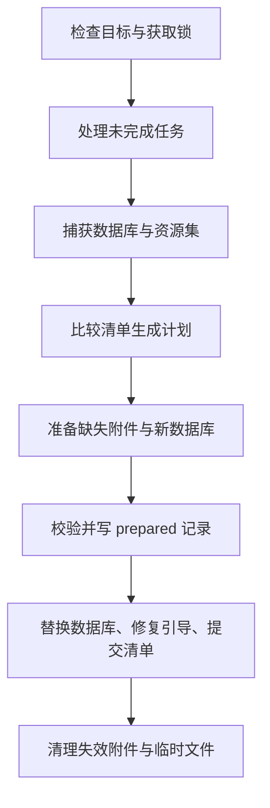
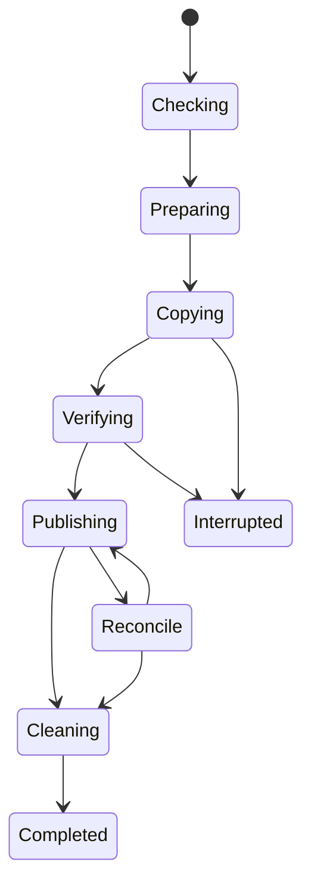

# Anynote 本地磁盘备份设计文档

> 版本：0.1 · 日期：2026-10-04 · 状态：实现设计基线。
>
> 需求：用 JavaScript/Node.js 将 Anynote 笔记仓库从源磁盘备份到另一块磁盘；文件级增量复制；维护一份当前备份，不保留增量快照或历史备份链。

## 1. 设计结论与范围

采用 **单向、单份当前副本、文件级增量的本地备份**。

每次任务将目标副本更新为本次捕获的仓库状态：新增文件复制、内容变化文件整体替换、未变化文件跳过；目标端已由 Anynote 管理但不再需要的文件，在新状态提交后清理。

备份引擎使用 Node.js 文件系统、流、哈希与任务控制实现，不执行 rsync、不依赖远程服务器、不需要网络。SQLite 一致性备份复用应用已有数据库驱动；“JS 实现”指编排和复制逻辑由 JS 实现，不要求将 Electron/SQLite 的底层原生能力全部重写为纯 JS。

### 1.1 明确边界

| 项目 | 本方案 |
| --- | --- |
| 源与目标 | 本地挂载磁盘，建议不同物理设备 |
| 方向 | 源仓库 → 目标备份目录 |
| 增量粒度 | 整个文件；变化文件完整复制 |
| 备份版本 | 只保留一个当前版本 |
| 历史快照/增量链 | 不提供 |
| 块级差量/rsync 算法 | 不提供 |
| SQLite | 获取一致性临时数据库副本后整体替换 |
| 附件 | 内容寻址、不可变，按哈希复用 |
| 删除 | 新状态提交后删除不再引用的受管文件 |
| 中断 | 保留可恢复数据库与资源集合，恢复任务或重新运行 |
| 恢复 | 从完整当前副本恢复，不需要重放历史链 |
| 文件校验 | 新复制文件校验；未变化文件快速检查，另提供完整校验 |

**SQLite 的一致性临时副本是复制过程中的技术措施，不是历史快照功能。** 每次成功后临时数据清理，不建立按日期累积的备份版本目录。

只保留当前副本意味着源端误删、错误修改或数据损坏可能在下一次成功任务中反映到目标；不能提供“恢复昨天版本”。同一块物理磁盘的两个分区也不具备独立磁盘故障保护能力。

### 1.2 与原整体设计的关系

本文件作为《Anynote 产品与技术设计文档》的独立补充，沿用：

- 一个 Notebook 一个 SQLite 数据库。
- 附件为内容寻址的不可变文件；数据库记录资源引用。
- 缓存、临时文件、运行锁不属于持久化知识数据。
- 资源 GC 必须尊重备份期间的资源 pin。
- 核心管理数据一致性，Provider 负责目标存储访问。

原设计的远程备份、版本保留与历史 generation 不适用于本 Provider。本地磁盘备份是核心提供的默认离线能力；其他远程后端可独立存在，配置本地备份不要求部署它们。

## 2. 产品行为

### 2.1 配置项

| 配置 | 建议默认值 | 说明 |
| --- | --- | --- |
| 目标磁盘目录 | 用户选择 | 在其下创建独立 Anynote 备份根目录 |
| Notebook 范围 | 用户选择或全部 | 使用稳定 UUID，避免重名覆盖 |
| 自动备份 | 开启后每 10min 检查变化 | 合并连续编辑，避免每次输入复制数据库 |
| 手动立即备份 | 随时可用 | 先保存可提交草稿，再执行 |
| 删除处理 | 清理失效受管文件 | 必须在成功提交之后执行 |
| 附件复制并发 | 2 | HDD 可调为 1，SSD 可测试 4 |
| 校验 | 新文件校验 + 已有文件快速检查 | 可手动执行全量校验 |
| 插盘触发 | 开启自动备份时可启用 | 先确认目标身份，再运行 |

首次配置展示目标实际路径、容量、仓库范围与单向更新说明。确认初始化后，正常后续备份无需重复确认。

### 2.2 删除语义

采用“当前有效数据镜像”，但不是递归删除整个目标目录：

- 源 Notebook 内放入回收站的笔记仍在数据库中；其资源若仍被回收站/历史引用，继续保留。
- 只有不在本次数据库资源闭包中的受管附件，才可在成功提交后清理。
- Notebook 在 UI 中移出备份范围，不自动删除目标副本；提供单独的“删除该 Notebook 的备份”。
- 源目录不存在、磁盘离线、权限错误、读取失败，不等于用户删除内容，禁止据此清空目标。
- 用户放入目标目录的未知文件不自动删除；报告异常或冲突。

### 2.3 状态展示

每个目标显示最近完成时间、待备份状态、检查/复制进度、复制与跳过文件数、实际复制字节数、失败原因。

状态区分：`检查中`、`准备数据库`、`复制中`、`校验中`、`提交中`、`清理中`、`已完成`、`备份已更新但清理待重试`、`等待磁盘`、`失败`、`已取消`。

没有历史版本列表。恢复界面只展示当前备份的信息与校验状态。

## 3. 存储布局与备份范围

### 3.1 源仓库布局

源仓库可以包含一个或多个 Notebook：

```text
<repository-root>/
  notebooks/
    <notebook-id>/
      notebook.json
      notebook.sqlite
      assets/sha256/ab/<hash>.bin
      cache/
      temp/
      locks/
```

实际源路径可以不同，Repository Adapter 负责枚举；不以文件夹显示名称作为 Notebook 身份。

### 3.2 目标布局

```text
<selected-directory>/AnynoteBackup/
  backup-root.json
  notebooks/
    <notebook-id>/
      notebook.json
      notebook.sqlite
      assets/sha256/ab/<hash>.bin
      .backup/
        manifest.json
        prepared.json             # 有待提交任务时存在
        task.json                 # 有进行中/待恢复任务时存在
        staging/<task-id>/
        lock/
```

稳定文件只有一份：`notebook.sqlite` 与受引用附件。`staging/` 是临时工作区，完成或安全取消后清理；不得借此永久保留历史数据库。

`backup-root.json` 记录格式版本、目标 UUID、初始化信息。Notebook manifest 保存当前切点、数据库哈希、文件清单与校验状态。manifest 不是历史增量链。

### 3.3 包含与排除

| 文件/数据 | 是否备份 | 原因 |
| --- | --- | --- |
| SQLite 业务数据库 | 是 | 笔记、目录、标签、版本、批注等 |
| 被数据库引用的图片/PDF/白板等附件 | 是 | 持久化知识内容 |
| 历史 Revision/回收站引用的附件 | 是 | 既有知识数据的一部分 |
| `notebook.json` | 是，按快照数据库生成 | 轻量引导信息，避免并发名称不一致 |
| SQLite `-wal`、`-shm`、journal | 否 | 由一致性副本消解，不直接混合复制 |
| cache、缩略图、FTS/向量外部缓存 | 否 | 可重建 |
| 源 snapshots 目录、旧备份 | 否 | 不递归备份已有备份 |
| temp、locks、日志、设备配置 | 否 | 运行状态 |
| API key、凭据、系统密钥 | 否 | 不属于 Notebook |
| 插件持久化数据 | 是 | 必须通过数据库或资源 API 纳入引用闭包 |
| 插件代码/依赖目录 | 否 | 可重新安装 |

本方案备份的是可恢复的知识仓库，不是把源目录每一个字节原样复制。持久化插件文件不得藏在任意缓存或未声明路径；否则无法保证备份完整性。

## 4. 架构与项目位置

建议实现为 `packages/backup-local`，由桌面应用默认集成。目标无需远程凭据与服务器，用户只授权目标目录。

| 模块 | 职责 |
| --- | --- |
| `LocalBackupService` | 任务调度、Notebook 范围、状态与取消 |
| `RepositoryAdapter` | 列出 Notebook、读取持久化范围与版本标记 |
| `SnapshotService` | 一致性数据库副本、资源闭包与 pin |
| `TargetGuard` | 路径、目标身份、挂载状态、锁与能力检查 |
| `DiffPlanner` | 比较当前文件清单与目标 manifest |
| `FileCopier` | 限流复制、临时文件、哈希校验与替换 |
| `CommitCoordinator` | 附件准备、数据库发布、manifest 与中断恢复 |
| `CleanupService` | 提交后删除失效受管对象与临时文件 |
| `RestoreService` | 完整校验、复制到新本地目录、注册 Notebook |

复制工作在 Electron utility process 或后台任务进程中执行；Main 只负责窗口与调度，Renderer 只显示进度和发起操作。Node 子进程隔离用于避免 UI 阻塞，不是插件权限沙箱。

不建议直接将通用目录同步库当作完整方案，因为它不了解 SQLite、资源闭包和发布顺序。可以使用成熟的并发/日志组件，但核心一致性流程应由 Anynote 控制。

## 5. 文件级增量判定

### 5.1 使用分层策略

不同文件类型采取不同策略：

| 类型 | 变化判定 | 执行动作 |
| --- | --- | --- |
| 不可变附件 | 哈希身份 + 目标存在/大小 + 校验记录 | 未变跳过；缺失或异常则复制/修复 |
| SQLite | 内容/维护版本标记初筛，再比较一致性副本哈希 | 未变不生成/复制；变化时整体复制 |
| 小型引导 JSON | 从快照生成确定性内容，比较哈希 | 不同才替换 |
| 声明的可变 sidecar | 源元数据初筛，必要时内容哈希 | 内容相同不复制 |

**修改时间和大小不是内容相同的严格证明。** 同大小修改、时间戳精度、手动保留时间和跨文件系统差异可能误判。对于 Anynote 自己管理的附件，优先使用“不可变 + SHA-256”契约。

### 5.2 不可变附件

源附件哈希在首次入库时已计算，备份无需每次重新读取全部源附件内容。

普通运行：

1. 源快照提供附件哈希、大小与逻辑相对路径。
2. 目标 manifest 有匹配条目，且文件是普通文件、存在、大小一致、目标校验 token 未变化，则跳过内容复制。
3. 无条目、文件缺失、大小/token 异常时，读取目标哈希；不匹配则复制正确源附件。
4. 新复制附件读取校验，匹配源已知 SHA-256 后标记已验证。

校验 token 使用复制后读取的目标 `size`、`mtimeNs`、必要的 `ctimeNs` 等；在当前平台不可用时采用实际支持字段。它是快速异常检测，不是密码学保证。

如果用户或其他程序在目标盘改写内容并保留元数据，快速模式不能可靠发现。提供“完整校验”读取所有文件并比对哈希；UI 不把快速检查描述成全量完整性验证。

### 5.3 SQLite 无变化判定

不要使用活跃 `notebook.sqlite` 文件的大小/mtime 作为唯一判定，因为 WAL 中可能已有新提交而主文件暂未变化。[R2][R3]

维护一个可靠的 `backupRevision`，建议包含：

```typescript
interface BackupRevision {
  notebookId: string;
  lineageId: string;
  contentSeq: string;
  schemaVersion: number;
  storageEpoch: string;
}
```

- `contentSeq`：所有需备份的业务变更都推进。
- `storageEpoch`：迁移、历史压缩、持久化维护等改变数据库备份内容但未形成普通业务操作时推进。
- `lineageId`：数据库从别处恢复/替换后改变，避免旧序号碰巧相等。
- 任务进度、阅读位置、纯缓存更新不推进这些标记。

与目标完成状态一致时，可以跳过生成新 SQLite 副本，但仍快速检查目标数据库/资源存在及元数据；发现目标缺失、token 改变或备份状态不完整，则重新校验/修复。

版本标记是产品契约，不是 Node 文件系统自动提供的能力。尚未建立可靠标记时，每次任务必须生成一致性副本并比较哈希，性能较低但行为正确。

新副本哈希与目标相同，则不复制数据库；哈希不同则整体复制，不尝试页级 patch。

### 5.4 可变附加文件

推荐插件通过资源 API 保存不可变 Asset，避免可变 sidecar。如果确需支持可变文件：

- `size/mtime` 只用于快速模式；严格模式逐文件计算内容哈希。
- 复制前后比较源 stat，并结合领域版本；期间变化则重试或失败。
- 前后 stat 一样仍无法防止任意外部程序同大小/同时间改写；严格一致性需要应用锁、冻结或临时不可变副本。
- 通用可变文件集合不具备 Notebook 数据库发布原子性，不能套用附件协议后宣称全仓库原子更新。

v1 的强一致性保证以“SQLite + 不可变资源 + 可再生引导 JSON”为边界。

## 6. SQLite 一致性与资源切点

### 6.1 一致性副本

对打开中的 SQLite 使用已有驱动封装的 Online Backup API，输出到本机任务临时目录。复制的是这个已完成的独立数据库，而非活跃 `.sqlite`、`-wal` 和 `-shm`。[R2][R3]

示例接口：

```typescript
interface NotebookCapture {
  notebookId: string;
  revision: BackupRevision;
  databasePath: string;
  databaseSha256: string;
  databaseSize: number;
  bootstrapBytes: Uint8Array;
  assets: AsyncIterable<AssetEntry>;
  release(): Promise<void>;
}

interface SnapshotService {
  captureForBackup(input: {
    notebookId: string;
    signal: AbortSignal;
  }): Promise<NotebookCapture>;
}
```

接口名沿用已有 Snapshot Service，但捕获结果仅供当前任务临时使用，不保留历史快照。

### 6.2 捕获顺序

1. 请求编辑器保存可提交草稿；中文输入组合态未完成时等待或仅捕获最近已保存状态，并向任务说明。
2. 进入 Notebook 写队列 barrier，阻止本次切点捕获期间的写入；阻止资源 GC。
3. 生成一致性数据库副本；从该副本读取实际 `backupRevision` 与所需资源闭包。
4. 将资源闭包转为任务 pin，生成与副本匹配的 `notebook.json`，释放写 barrier。
5. 允许继续编辑；更晚的修改留待下次备份。
6. 任务成功、失败或取消后释放 pin；未完成目标不因此成为“成功备份”。

大型数据库下 barrier 可能等待较久，UI 可继续输入但显示“等待本地保存”。后续可用在线备份和稳定读视图优化，必须从最终副本确认切点，同时保证 GC 不删正在捕获的资源。

### 6.3 资源闭包

附件集来自捕获数据库，包括活跃笔记、历史 Revision、回收站、白板内图片、批注关联对象以及插件持久化资源。

源目录扫描只用来验证文件存在，不能代替数据库引用闭包。源 `assets/` 内孤儿文件不备份；源快照引用的文件缺失则失败，禁止用不完整资源集替换目标数据库。

每个 Notebook 独立捕获和提交。多个 Notebook 不保证同一全局时间点；仓库任务按 Notebook 显示成功与失败，不因一项成功就显示全部完成。

## 7. 复制与发布协议

### 7.1 核心原则

**先准备附件，再发布数据库，最后清理旧附件。**

因为附件不可变且以哈希区分，新增附件不会破坏旧数据库；旧数据库仍使用旧资源，直到完整新数据库替换成功。

不承诺目录级多文件原子事务。发布点是目标 `notebook.sqlite` 的受控替换；其他元数据可通过记录与数据库重建。断电耐久性还取决于文件系统和硬件。

### 7.2 完整流程



1. **检查目标**：目录身份、挂载、空间、可写、路径关系、锁、文件系统能力。
2. **处理恢复**：如果有 `prepared.json`，先完成恢复协调；不能把它当普通临时垃圾删除。
3. **捕获与计划**：拿到确定的数据库与资源切点，计算 copy/skip/replace/delete 集合。
4. **复制附件**：每个附件写目标同文件系统临时路径，校验、flush、关闭后 rename 到最终哈希路径。
5. **复制数据库**：将一致性数据库副本复制到目标 staging，校验 SHA-256、SQLite 检查与资源存在状态。
6. **写 prepared**：保存旧/新数据库哈希、新清单哈希、新切点、task ID，flush；新 manifest 内容和引导 JSON 也保存在 staging。
7. **发布数据库**：目标 DB 关闭、目标目录禁止打开为工作仓库；用同文件系统受控 rename/replace 将新 DB 替换到固定路径。
8. **发布元数据**：根据已发布 DB 写入 `notebook.json`，原子替换 manifest；各文件单独提交，中间状态由 prepared 协调恢复。
9. **标记完成**：manifest 与目标数据库哈希/资源集匹配，任务进入可恢复完成状态。
10. **清理**：删除旧 manifest 记录且当前闭包不再需要的附件、遗留临时文件；清理失败不回滚已完成备份，显示待重试。

首次备份没有旧数据库时，中断后可能只有附件；不能标记可恢复完成。新数据库发布并完整验证后才可恢复。

### 7.3 单文件安全复制

`fs.copyFile()` 本身不保证复制原子性，不能直接覆盖正式数据库或其他可变文件。[R1]

基本流程：

```text
创建独占临时文件
→ 完整复制
→ 校验长度与哈希
→ flush 并关闭文件
→ 受控同文件系统替换
→ 支持的平台执行目录同步
→ 更新对应状态
```

临时文件与最终文件必须在目标同一文件系统。源到目标跨盘 rename 会失败或无法提供所需语义，应先 copy 到目标临时路径，再在目标盘内 rename。

可用 `fs.copyFile` 获得系统复制路径；需字节进度、流内哈希、快速取消时使用 stream/pipeline 或有界读写循环。流内哈希校验输入字节，不等于目标落盘内容已校验；严格写后校验需要重读目标临时文件。

Node `FileHandle.sync()` 用于请求数据落盘，但具体行为由操作系统/设备决定；目录项同步不是所有平台都支持统一 JS 做法，需能力探测与实测，不能宣称任意拔盘时绝对不会损坏。[R1]

### 7.4 替换失败

Windows 文件被阅读器、杀毒软件或其他进程占用时，rename/replace 可能失败；有限重试，最终失败保留旧数据库与 prepared 信息。

不得以 `unlink(oldDatabase)` 再 `rename(newDatabase)` 作为通用 fallback，因为这会产生没有数据库的窗口。无法安全覆盖替换的目标文件系统应拒绝强一致性模式或进入明确的受控维护方案，不静默降低保证。

同一目标磁盘不能作为正在编辑的 Notebook。用户恢复时先复制到新的工作目录，避免工作进程打开目标数据库妨碍提交。

## 8. 删除与清理

### 8.1 删除计划

```typescript
const deletions = previousManifest.files.filter(
  file => file.role === 'asset' && !currentReferencedPaths.has(file.path)
);
```

删除集合只能来自先前受管 manifest 或经恢复确认的受管任务记录，不能来自“目标目录所有多余文件”。当前 manifest 中仍有引用的文件不得删除。

删除必须满足：新数据库和 manifest 已提交、目标 UUID 一致、Notebook 范围合法、无源读取失败、没有未知中断状态。

### 8.2 不做的删除

- 源磁盘离线时不推导全删除。
- 目标盘挂载消失时不在原路径新建空备份并继续清理。
- Notebook 在配置中取消勾选时不自动删除其现有副本。
- 不删除目标目录的用户文件、未知文件或其他应用目录。
- 不跟随符号链接递归删除，目录组件出现 symlink/junction 时终止。

### 8.3 清理失败

数据库更新成功而清理失败时，当前备份仍可恢复，目标只是存在多余附件。持久化 cleanup 队列，下次取得锁后继续；对已无引用、允许清理的对象重复删除应幂等。

成功完成后不保留旧数据库、旧 manifest 或附件回收历史。任务短期临时记录仅用于恢复协调，不提供历史恢复入口。

## 9. 中断、取消与恢复协调

### 9.1 状态机



其他阶段也可能失败，实际实现统一记录错误；图仅展示影响一致性的主要路径。

### 9.2 中断点行为

| 中断位置 | 目标内容 | 后续动作 |
| --- | --- | --- |
| 检查/捕获期间 | 旧备份未变化 | 重新捕获 |
| 复制附件期间 | 旧 DB + 旧附件 + 部分新增附件 | 旧备份可恢复；复用校验过的新对象 |
| 复制新 DB 期间 | 旧 DB 仍完整 | 删除/重做未完成临时 DB |
| prepared 写完但 DB 未替换 | 旧 DB + 已准备资源 | 可完成同一任务或安全取消 |
| DB 已替换，manifest 未替换 | 新 DB + 新旧资源，元数据滞后 | 比对 prepared 的新 DB 哈希，完成 manifest 与引导文件 |
| manifest 已提交，清理未完成 | 完整新备份 + 多余资源 | 继续清理 |
| DB 哈希不匹配旧值或新值 | 目标异常/损坏 | 停止自动发布与删除，完整检查后重新备份 |

恢复协调读取 `prepared.json` 和 staging 新 manifest，验证它们相互哈希一致。当前 DB 匹配新值时向前完成提交；匹配旧值时保持旧状态或重试发布。无法证明状态时不做猜测性删除。

如果源磁盘已经损坏，也可使用 prepared 与新 DB 继续恢复协调，只要所有被引用资源均在目标且校验通过。

### 9.3 取消语义

- 检查/准备/复制阶段：停止创建新任务，结束正在执行的不可取消系统复制或终止流，清理明确未完成的临时文件。
- 已完成附件可暂留，下次复用或安全清理。
- 一旦进入数据库发布的短临界区，延后取消，先完成可判定的提交状态。
- 清理阶段可以停止，标记备份完成、清理待处理。
- 不支持文件内部块级续传；中断的单个大文件下次重复制，但其他完整已校验文件可复用。

## 10. 目标磁盘、路径与锁

### 10.1 目录与设备验证

初始化目标时创建独占备份根及 `backup-root.json`；后续必须匹配已配置 target UUID。应用自动运行时不为“找不到标记”的路径重新初始化。

使用 `realpath` 与按路径组件比较，拒绝源=目标、目标位于源内部、源位于受管目标内部，以及 symlink/junction 导致的重叠。不能只使用字符串 `startsWith` 判断，例如 `/data/a` 与 `/data/ab`。

“不同物理磁盘”的识别可能需要操作系统设备枚举；Node 的 `stat.dev` 只提供文件系统/设备标识，不能跨平台证明两个分区位于不同物理设备。识别不了时如实提示，不影响用户明确选择后的可用性。

### 10.2 防止磁盘离线后写错位置

外接盘卸载后，原挂载路径可能仍存在或可在系统盘创建。任务需：

- 每个阶段和重大写入前确认根标记与目标身份。
- 有平台卷信息时校验卷标识/挂载状态。
- 运行中 I/O 错误立即停止发布与删除，不自动 mkdir 整个原目标根。
- 普通子目录可在确认根身份之后创建。
- 不保证对恶意并发换挂载或路径替换完全免疫；专用目录权限与目标锁是前提。

### 10.3 目标锁

通过原子独占创建锁目录或锁文件取得任务锁，记录 host/session/task ID；锁覆盖整个目标根，避免两个应用或 Provider 同时更新。

普通任务排队；来源不同但目标相同也不能并发。Notebook 内复制文件可限流并行，数据库发布与清理仍顺序执行。

陈旧锁不能只因“时间超过 N 分钟”就强删。检查本机进程会话与任务状态；来自另一台机器、无法确认时暂停自动运行，提供用户解除锁入口。心跳只作诊断，不是排他保证。

### 10.4 文件系统支持

| 目标 | 建议 |
| --- | --- |
| NTFS / APFS / ext4 等本地文件系统 | 主要支持对象，按平台验证替换与恢复 |
| exFAT 外接盘 | 可作为兼容目标，重点验证时间戳、拔盘、中断与 rename 行为 |
| FAT32 | 受单文件大小等能力限制；大 SQLite/PDF 无法备份时明确拒绝 |
| SMB/NFS/云盘挂载 | v1 不承诺本方案的本地文件系统保证，另做适配 |

不依赖 ACL、xattr、hardlink 或 reflink 才能恢复 Notebook。备份保留内容和必要格式元信息；操作系统属主/ACL 不要求与源完全一致。

## 11. 清单、计划与公共接口

### 11.1 当前 manifest

```json
{
  "format": "anynote.local-backup",
  "formatVersion": 1,
  "targetId": "target-uuid",
  "notebookId": "notebook-uuid",
  "taskId": "task-uuid",
  "completedAt": "2026-10-04T11:00:00Z",
  "revision": {
    "lineageId": "lineage-uuid",
    "contentSeq": "128",
    "schemaVersion": 1,
    "storageEpoch": "3"
  },
  "database": {
    "path": "notebook.sqlite",
    "size": 1048576,
    "sha256": "<64位十六进制哈希>"
  },
  "files": [
    {
      "path": "assets/sha256/ab/<hash>.bin",
      "role": "asset",
      "size": 524288,
      "sha256": "<64位十六进制哈希>",
      "targetToken": {
        "size": "524288",
        "mtimeNs": "<实际目标时间戳>"
      }
    }
  ],
  "verification": {
    "newFilesReadback": true,
    "lastFullVerifiedAt": null
  }
}
```

占位字段在正式格式中必须是合法值。manifest schema 校验相对路径、hash、大小、角色与计数；大整数以十进制字符串保存，避免 JS/JSON 精度损失。

manifest 从一致性数据库生成，不能仅从文件系统扫描拼成。大规模资源可使用分片清单或 JSONL 作为后续优化，第一版先评估全量 JSON 内存与写入量。

### 11.2 计划接口

```typescript
interface LocalBackupPlan {
  taskId: string;
  notebookId: string;
  targetId: string;
  expectedPreviousDatabaseHash: string | null;
  revision: BackupRevision;
  copyAssets: AssetEntry[];
  skipAssets: AssetEntry[];
  replaceDatabase: boolean;
  deleteAfterCommit: ManagedFileEntry[];
  estimatedCopyBytes: number;
  estimatedTemporaryBytes: number;
}

interface LocalBackupAPI {
  configure(input: LocalBackupConfig): Promise<BackupTarget>;
  preview(input: BackupInput): Promise<BackupEstimate>;
  run(input: BackupInput, ctx: TaskContext): Promise<BackupResult>;
  verify(input: VerifyInput, ctx: TaskContext): Promise<VerificationReport>;
  restore(input: RestoreInput, ctx: TaskContext): Promise<RestoreResult>;
  cancel(taskId: string): Promise<void>;
}
```

这些是说明性接口，引用类型需在 SDK 定义。大型计划实际可用 async iterator/分页而非全部数组；Provider 不获得任意 Renderer 传入路径，只接受核心授权的目标句柄。

### 11.3 任务结果

返回各 Notebook 的 `copiedFiles`、`skippedFiles`、`deletedFiles`、`copiedBytes`、检查与校验耗时、切点、清理状态、错误码。

建议错误码：`TARGET_OFFLINE`、`TARGET_ID_MISMATCH`、`PATH_OVERLAP`、`TARGET_LOCKED`、`NO_SPACE`、`SOURCE_ASSET_MISSING`、`SOURCE_CHANGED`、`HASH_MISMATCH`、`REPLACE_FAILED`、`BACKUP_INCONSISTENT`、`UNSUPPORTED_FILESYSTEM`。

### 11.4 流程伪代码

```typescript
async function backupNotebook(input: BackupInput, ctx: TaskContext) {
  const lock = await targetGuard.acquire(input.target);
  let capture: NotebookCapture | undefined;

  try {
    await commitCoordinator.reconcile(input.target, input.notebookId);
    await targetGuard.validate(input);

    capture = await snapshotService.captureForBackup({
      notebookId: input.notebookId,
      signal: ctx.signal,
    });

    const previous = await manifests.readCurrent(input);
    const plan = await diffPlanner.create(capture, previous, input.target);

    await copier.ensureAssets(plan, capture, ctx);
    await copier.prepareDatabase(plan, capture, ctx);
    await verifier.checkPrepared(plan, capture, ctx);
    await commitCoordinator.writePrepared(plan, capture);

    // 短提交临界区不立即响应取消，完成可判定状态。
    await commitCoordinator.publishDatabaseAndMetadata(plan, capture);

    return await cleanupService.finishOrReportPending(plan, ctx);
  } finally {
    await capture?.release();
    await lock.release();
  }
}
```

这是流程示意，不是完整实现。无变化快路径可在 capture 前执行，但必须验证 revision 可靠、目标状态无中断且快速检查通过。prepared、复制器、替换与锁的细节应分别实现并测试。

## 12. Node.js 实现策略

### 12.1 推荐标准能力

| 能力 | Node 实现 |
| --- | --- |
| 枚举目录 | `fs.promises.opendir`，迭代遍历 |
| 文件类型和元数据 | `lstat` / `stat`，必要时 `{ bigint: true }` |
| 普通快速复制 | `fs.promises.copyFile`，只写临时文件 |
| 可取消/可进度复制 | `createReadStream` / `createWriteStream` + `pipeline` |
| SHA-256 | `crypto.createHash`，流式计算 |
| 安全暂存 | 独占创建、随机 task/file ID |
| 发布 | 受控 `rename` / 已验证平台替换适配 |
| 请求落盘 | `FileHandle.sync()`，平台能力允许时同步目录 |
| 空间检查 | `statfs`，按 Electron 内嵌 Node 版本确认支持 |
| 调度 | 有界 worker pool / concurrency limiter |

Electron 内嵌 Node 版本决定可用 API，不能仅按系统 `node` 版本开发。实现时检查支持矩阵。[R1]

### 12.2 为什么不直接递归 cp

通用 `fs.cp` 可以复制目录，但不会自动提供本方案所需的：

- SQLite 切点与资源闭包。
- 基于受管清单的精确删除。
- 目标身份与挂载校验。
- 数据库最后发布与 prepared 恢复协调。
- 不变文件跳过的应用版本契约。

因此文件复制是一个基础操作，备份流程需要在其上实现。

### 12.3 目录扫描与 watcher

任务主要枚举数据库资源集和目标清单，避免每次对缓存/日志全量递归扫描。目标文件仍需有界并发 `lstat` 或周期盘点，防止仅信任 manifest 而忽略真实缺失。

文件 watcher 只用于提示“可能有变化”并触发检查；事件丢失、合并、平台差异不能影响正确性。每次任务依赖版本标记与文件清单，不依赖完整 watcher 日志。[R1]

### 12.4 内存与线程

- 不对大 PDF、数据库、视频使用 `readFile` 全量读入内存。
- 每个复制流有界缓冲，初始可试 1MB；最终按性能测试选择。
- 并发复制和哈希同时设上限，避免文件描述符、libuv 线程池与磁盘队列失控。
- 不默认增加 `UV_THREADPOOL_SIZE`；先测 SQLite、复制、哈希和其他后台任务是否竞争。
- UI 进度节流，建议 100–250ms 更新，禁止每个 chunk 发一次 IPC。
- 同一 Notebook 同时进行导出/备份时共用资源 pin 和 I/O 预算。

## 13. 性能与空间预算

### 13.1 性能构成

```text
总耗时 ≈ 目标检查与计划
       + SQLite 一致性副本生成
       + 变化字节复制
       + 必要校验读取
       + 提交与清理
```

文件级增量主要减少复制字节，不会完全消除目录/清单检查成本。文件越多，小文件元数据开销越明显；SQLite 越大，变化后整库复制的代价越明显。

### 13.2 常见情况

| 场景 | 主要工作量 |
| --- | --- |
| 首次备份 | 整库与全部引用附件复制、校验 |
| 没有变化 | 版本标记比较、目标快速检查；不复制内容 |
| 只改 Markdown 正文 | 生成并复制变化后的完整 SQLite；原附件不复制 |
| 新增图片/PDF | 新 SQLite + 新附件；其余附件跳过 |
| 附件改名 | 若仅数据库原文件名变化，复制 DB，不复制相同附件字节 |
| 删除笔记 | 复制新 DB；提交后按引用清理失效附件 |
| 完整校验 | 读取目标全部受管文件，不必复制所有文件 |

例如：仓库附件 20GB、SQLite 100MB，只改一段文字，通常只向目标复制新的约 100MB SQLite 和少量元数据。若新增 5MB 图片，再复制该图片。实际数据库大小和文件系统开销可能变化，此处是传输量示意，不是测量结果。

### 13.3 估算示例

假设实际持续复制吞吐为 200MB/s：100MB 数据库的纯写入约 0.5s；另需生成源副本、读取源文件、写后校验、flush 和元数据操作。

不能以“复制量/标称 USB 速度”当作最终耗时。HDD seek、外接盒、杀毒、目标校验与磁盘缓存都会影响实际时间。性能数据应从真实平台测量得出。

### 13.4 空间预算

- 源/本机临时区需容纳一个一致性 SQLite 副本，以及捕获期间可能增长的 WAL。
- 目标需同时容纳旧完整数据库与新数据库临时文件，直到替换完成。
- 新附件复制前不能靠先删旧附件腾空间；旧备份资源要保留到提交之后。
- 预估额外目标空间：新数据库 + 缺失附件 + 清单/临时文件 + 安全余量。
- 磁盘空间检查只是预估，其他程序可能继续写盘；实际 ENOSPC 必须正常处理。

### 13.5 优化优先级

1. 建立准确 backupRevision，让无变化任务跳过数据库捕获。
2. 利用不可变附件入库哈希，避免每次重算全仓库源哈希。
3. 使用有界并发与批量/流式清单，减少小文件扫描负担。
4. 为 HDD、SSD 调整复制与校验并发。
5. 更大 Notebook 优化数据库捕获 barrier 和任务频率。

跨磁盘不依赖 hardlink/reflink；`COPYFILE_FICLONE` 可以作为可选优化，但底层不支持时会回退，不能把它当作跨设备通用加速机制。[R1]

## 14. 恢复与校验

### 14.1 恢复流程

1. 确认目标身份，取得读/协调锁，处理未完成 prepared 状态。
2. 读取当前 manifest，核验版本和路径。
3. 校验数据库 SHA-256、SQLite `quick_check`/必要的 `integrity_check`、外键与资源引用。
4. 完整恢复建议校验所有被引用附件哈希；缺失/损坏列出明确报告。
5. 将数据库与附件复制到新的本地工作目录，不直接打开备份目录编辑。
6. 对恢复结果执行必要格式迁移、重建缓存与索引，注册 Notebook。
7. 如保留 Notebook ID，重置本机任务状态与 lineage，确保下一次不会误判“已备份”；恢复为副本时沿用整体设计的身份重映射规则。

多个 Notebook 可分别恢复。仓库级恢复结果明确哪些完成、哪些失败。

### 14.2 manifest 丢失

manifest 是复制索引和校验依据，不是唯一知识真源。若目标数据库仍可读，可从数据库重建资源闭包与引导信息。

没有原 manifest 的可信 hash 时，只能验证文件存在、SQLite 结构和内容寻址附件哈希，不能证明数据库与过去源状态逐字节一致。标记为“已重建、需核验”；有源可用时重新运行完整备份并生成新 manifest。

### 14.3 校验模式

| 模式 | 读取范围 | 保证 |
| --- | --- | --- |
| 普通备份 | 新文件完整校验；未变化文件快速 token 检查 | 高性能正常更新，检测常见缺失/修改 |
| 完整校验 | 所有受管文件 SHA-256 | 发现同大小、时间戳未变化的内容损坏 |
| 自动修复 | 依据一致性源重新复制异常文件 | 源可信且可用时修复目标 |

源数据库或附件已损坏时，不自动覆盖目标中可能完好的数据。检查失败后停止，提供“从当前备份恢复到新目录”入口。

## 15. UI 设计

设置 → 备份 → 本地磁盘：一张清晰的目标卡片即可，不把内部 journal、hash 和状态文件暴露给普通用户。

目标卡片显示：磁盘名称、目标路径、在线状态、可用空间、所选 Notebook、最近完成时间、自动检查间隔。

主操作：**立即备份、校验备份、恢复、修改位置**。低频删除备份入口放菜单，展示范围后确认。

备份任务显示“检查 3,200 个文件；复制 6 个，跳过 3,194 个；共复制 108MB”。无变化显示“检查完成，无需复制”，而不是“已全量备份”。

发生部分失败，显示“2 个 Notebook 已完成，1 个失败”，展开对应项；磁盘离线显示等待，不持续 toast。

源删除较多时，任务预览可提示将清理多少受管资源；正常自动备份遵循已授权策略，不每次弹出删除确认。删除量异常或清单不完整时停止清理并要求检查，而不是猜测源已清空。

恢复页注明只有当前副本，没有历史版本。视觉继承主设计的色彩、排版、面板与焦点规范。

## 16. 测试与验收

### 16.1 正常行为

- 首次备份后，干净环境能恢复所有 Notebook 与引用资源。
- 第二次无变化时，数据库与附件复制量为零；必要清单/检查操作不算内容复制。
- 修改一条 Markdown，只复制新 SQLite，不复制未变化附件。
- 新增/替换附件，复制新哈希文件；旧文件在提交后根据引用决定清理。
- 历史和回收站仍引用的附件不会被误删。
- 取消 Notebook 勾选不会自动删其目标副本。

### 16.2 故障注入

| 故障 | 验收结果 |
| --- | --- |
| 复制大附件中拔盘 | 无成功状态；旧 DB 未被破坏 |
| 附件完成但 DB 复制失败 | 旧备份可恢复；新附件可复用/清理 |
| DB 复制完但发布前崩溃 | 旧备份可恢复；prepared 可重试 |
| DB 发布后、manifest 前崩溃 | 通过新 DB 哈希完成协调，不按旧清单删除 |
| 清理中崩溃 | 新备份可恢复，下次继续幂等清理 |
| 目标数据库被占用 | 有限重试后失败，不能先删除旧 DB |
| 磁盘满 | 不发布不完整 DB；清晰提示额外空间需求 |
| 源附件缺失 | 捕获/验证失败，旧备份保留 |
| 源目录暂时不存在 | 不清空目标 |
| 目标标记不匹配 | 停止所有写入与删除 |
| 目标同大小内容被改写 | 全量校验发现；快速模式边界明确 |
| 任务执行期间继续编辑/GC | 目标与捕获切点一致，资源无遗漏 |
| 两个进程同时备份 | 目标锁只允许一个写入任务 |
| symlink/junction/路径重叠 | 拒绝执行或拒绝越界 |

### 16.3 平台与性能样本

至少覆盖 macOS/APFS、Windows/NTFS、Linux/ext4，外接 exFAT 作为兼容性样本。

建议基准：1,000/10,000/100,000 附件；大量小文件与大 PDF 混合；100MB/1GB SQLite；SSD→SSD、SSD→HDD、USB 外接盘。

记录首次复制、无变化检查、少量变更、大文件取消、全量校验、峰值内存、UI 响应与提交耗时。不要将 Linux 内部 SSD 上的单次测试推广为所有外接盘性能。

## 17. 实施顺序

| 阶段 | 交付 |
| --- | --- |
| P0 | 目标路径/身份/锁，数据库一致性副本与资源闭包 |
| P1 | 首次完整复制、临时文件校验、数据库最后发布、恢复 |
| P2 | manifest 差异计划、无变化快路径、提交后清理 |
| P3 | prepared 中断协调、取消、磁盘离线、空间与占用处理 |
| P4 | 自动调度、任务 UI、完整校验、跨平台故障测试与性能调优 |

首版不加入压缩包、内容分块、历史保留、远程协议或多目录双向同步。先完成“复制正确、跳过正确、恢复正确”的本地闭环。

## 18. 关键决策记录

| 决策 | 结论 |
| --- | --- |
| 本地备份是否依赖远程端 | 不依赖，完全离线 |
| 是否执行 rsync 程序 | 不执行，Node 文件能力实现 |
| 是否保留备份历史 | 不保留，只维护当前副本 |
| 活跃 SQLite 是否普通复制 | 不直接复制，先获取一致性临时副本 |
| 文件差异如何判断 | 应用版本标记 + 不可变哈希 + 分层校验 |
| 改变数据库如何传输 | 完整文件复制，不做页级差量 |
| 如何避免中断破坏旧副本 | 附件先准备、DB 后发布、清理最后执行 |
| 是否保证目录级事务 | 不保证，以 DB 发布点和恢复协调保证 Notebook 可恢复性 |
| 是否清理源删除文件 | 成功提交后，仅清理失效受管文件 |
| 是否把目标当工作库 | 不允许，恢复到新工作目录 |
| 是否备份缓存和已有备份 | 不备份 |
| 是否保证任意拔盘零损坏 | 不保证，受平台/硬件约束，需 flush、协调与实测 |

## 19. 官方依据

核实日期：2026-10-04。本文的布局、接口、删除规则、UI 与性能初值是 Anynote 设计建议；底层行为依据以下官方资料。

| 编号 | 官方资料 | 依据 |
| --- | --- | --- |
| R1 | [Node.js File System](https://nodejs.org/api/fs.html) | `copyFile` 无复制原子性保证、stream/fsync、watcher 与 reflink 边界 |
| R2 | [SQLite Online Backup API](https://www.sqlite.org/backup.html) | 活跃数据库一致性副本 |
| R3 | [SQLite WAL](https://www.sqlite.org/wal.html) | WAL 数据与主文件复制风险 |

